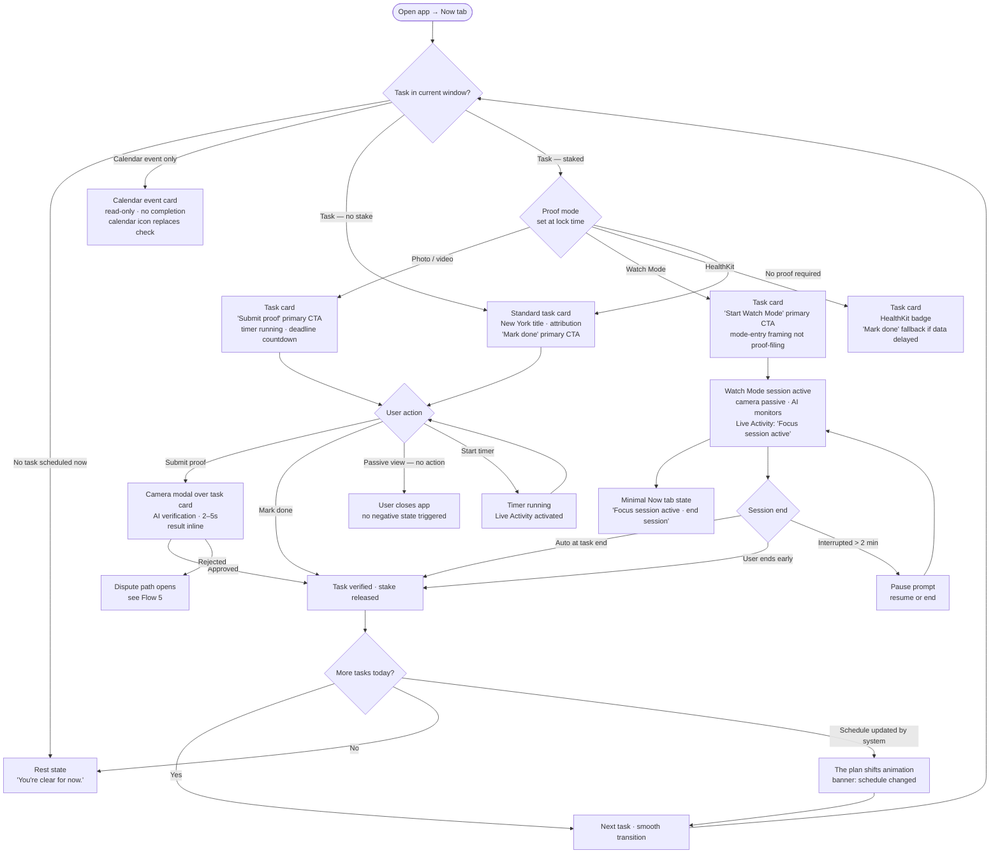
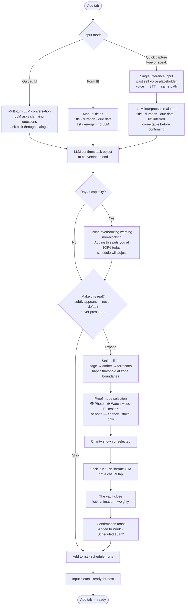
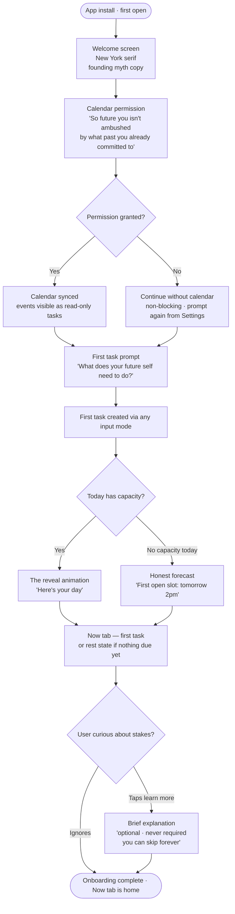
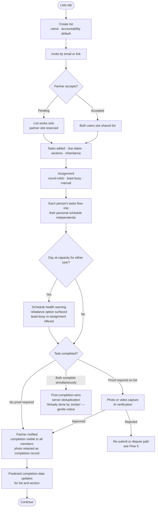
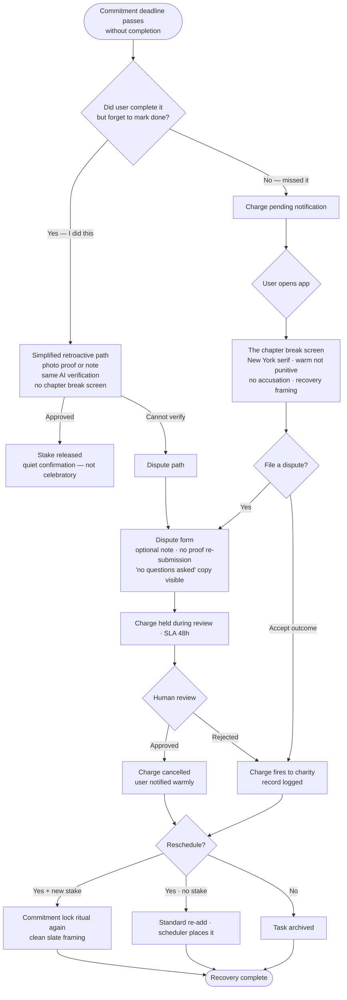

# UX Design Specification — On Task

**Author:** Matt
**Date:** 2026-03-29

---

<!-- UX design content will be appended sequentially through collaborative workflow steps -->

## Executive Summary

### Project Vision

On Task is a consumer iOS/macOS task management app built around three first-class differentiators — all primary marketing points, all requiring first-class UX design depth:

1. **Commitment locking** — a financial accountability mechanic designed to hack executive dysfunction by removing the *perception of choice*. When a user locks in a task, they are deliberately and voluntarily eliminating their own escape hatch — the same psychological mechanism as locking a phone in a timed box. The core cognitive frame: tasks are created by your *past self* for your *future self*. Language and UI reinforce this compassionate separation consistently — "your past self chose this for you", "be kind to your future self" — helping users reason about the gap between intention and execution without self-judgment. In collaborative contexts, this extends to named-person framing: "What do Morgan and Spencer need from you today?" — connecting personal accountability to relationships. This framing is never punishment or risk; it is always agency, care, and self-authorship.

2. **Flexible intelligent auto-scheduling** — a genuinely underserved consumer need. Motion, the leading consumer auto-scheduler, exited the consumer market. Skedpal serves a narrow power-user segment. On Task fills that void: a scheduling engine that respects calendar availability, time-of-day energy preferences, task dependencies, and user nudges — delivering the feeling that a thoughtful assistant made a plan *for you*, not that you filled out a form.

3. **Collaborative scheduling with teams** — neither Motion, Skedpal, nor Beeminder make collaborative goals easy. On Task treats shared scheduling as a first-class use case: couples, housemates, and households can manage shared task lists with intelligent multi-person scheduling, shared commitment stakes, and round-robin or pooled accountability mechanics. The goal is for users to run their entire lives — solo tasks and collaborative tasks — in a single, harmonious system. This is a genuine whitespace no current competitor occupies.

### Target Users

Adults with executive dysfunction tendencies who want to do things but struggle with follow-through when tasks remain optional. They've tried standard to-do apps and found them frictionless to the point of uselessness — there's no cost to ignoring a reminder. Secondary and equally important segment: households and couples sharing responsibilities, where accountability to others compounds the commitment mechanic and where coordinating two people's schedules is a daily friction point.

**Platform context:** iOS as primary; macOS as a genuine first-class platform (not a scaled-up phone UI). Users context-switch between both throughout their day.

### Key Design Challenges

- **Making "locking in" feel powerful, not punitive** — the commitment contract flow must feel like an act of self-care and planning. The past self / future self frame must be a consistent, designed voice throughout the product — not just marketing copy. Key touchpoints: task creation ("what does your future self need?"), commitment flow ("your past self is making a plan"), due date reminders ("past you planned this — future you is here now"), collaborative reminders ("what do [Name] and [Name] need from you today?").
- **Scheduling that feels magical, not overwhelming** — intelligent scheduling should reduce cognitive load, not add configuration burden; output should feel like a gift from a smart assistant, not a form submission
- **Collaborative scheduling as a distinct emotional space** — solo scheduling centers on self-knowledge; collaborative scheduling centers on relationship dynamics (load balancing, fairness, mutual accountability). These require dedicated empathy mapping and distinct interaction patterns.
- **Progressive disclosure across three entry points** — solo users, auto-scheduling users, and household users each enter the product through a different differentiator. Onboarding must surface all three within the first session without overwhelming. The discovery arc matters as much as the features.
- **Solo and collaborative in harmony** — the IA and navigation must make it feel natural to manage a personal task list and a shared household list side by side, without cognitive switching cost
- **Proof & verification UX** — submitting proof of task completion (photo, HealthKit, Watch Mode) must be fast and feel natural, not bureaucratic
- **macOS parity** — Watch Mode and HealthKit proof are iOS-only; macOS must degrade gracefully without feeling incomplete

### Design Opportunities

- **Owning the past self / future self voice** — a consistent, warm narrative voice threading through the entire product: task creation, reminders, completion screens, collaborative nudges. This voice is the brand.
- **Named-person framing in collaborative contexts** — "What do Morgan and Spencer need from you today?" — using real names makes accountability feel relational, not transactional
- **Scheduling as a superpower** — the auto-scheduler's output should feel like a thoughtful assistant made a plan for you; the reveal of a newly scheduled day is a product moment worth designing
- **The "lock in" ritual** — the act of committing financially to a task should be a distinct, satisfying micro-interaction; a vault door closing, not a form submit
- **iOS / macOS continuity** — tasks created on iPhone, managed on Mac; the cross-device experience is a differentiator most task apps ignore
- **Empathy mapping opportunity** — the past self / future self framing is a powerful lens for empathy mapping exercises in later design steps, especially for collaborative and commitment scenarios

## Core User Experience

### Defining Experience

The On Task core loop has two equally critical halves that must both be perfected:

1. **Capture** — adding a task must be fast, joyful, and frictionless. Users prone to procrasti-planning must not be rewarded for spending time configuring tasks instead of doing them. Users who avoid task apps must find adding tasks so effortless that it becomes a habit. The commitment lock flow is part of task creation — not a separate step — so the full flow from "I need to do a thing" to "I've locked it in" must feel seamless.

2. **Execute** — completing today's scheduled tasks must require zero decisions. The user opens the app and knows exactly what to do next. The daily view is ordered by schedule, not priority, because the scheduling engine has already made the priority decision for them.

### Platform Strategy

**iOS (primary):** Touch-first. Four-tab bottom navigation — every core action reachable in one tap from anywhere.

**macOS (first-class secondary):** Three-pane layout — sidebar (Lists), main area (Today/Now), contextual detail panel. Keyboard-first interaction with shortcuts for all primary actions. macOS gracefully excludes Watch Mode (iOS-only camera feature) and HealthKit, surfacing alternative proof paths. No scaled-up phone UI.

> **macOS menu bar app:** Planned V2 feature — ambient quick capture without opening the full app. Not day-one; day-one macOS is the three-pane Flutter app.

**Offline:** Full offline capability. Tasks can be created, completed, and committed offline. Sync resolves on reconnect per conflict resolution policy. Users must never feel the app is "unavailable."

**Device capabilities leveraged:**
- HealthKit (iOS only) — auto-pull for proof submission
- APNs — contextual push at the right moment, not just reminders
- Camera (iOS/macOS) — photo proof with minimal friction
- Watch Mode (iOS only) — real-time AI body doubling during task execution

### Information Architecture — Primary Navigation

**The schedule is list-agnostic.** Every task — from every list, personal or shared — enters the same scheduling engine and competes for time based on priority and due date. The unified schedule is the single source of truth for what to do next. List attribution (which list, which shared partner) is contextual metadata displayed inline, not a structural separation.

**iOS (bottom tab bar):**

| Tab | Label | Purpose |
|---|---|---|
| 1 | **Now** | The current task — one thing, full focus. Shows list/person attribution when relevant ("this is on your Household list with Spencer"). Actions: mark done, submit proof, start timer, enable Watch Mode, skip/defer |
| 2 | **Today** | All tasks for today in scheduled order — all lists unified. Calendar events as first-class immovable items. Schedule health indicator at top. List attribution inline. |
| 3 | **Add** | Dedicated task capture — smart single input. Type = NLP, tap mic = voice, tap expand = manual form. Quick capture and full creation flows supported. |
| 4 | **Lists** | Manage lists — create, configure, view full backlog, manage shared list members. Pending approvals badged here. |

**Settings:** Accessible via profile/account icon in the navigation header (persistent across all tabs). Contains: account, billing, notification preferences, scheduling preferences, calendar connections, energy preferences, session management, 2FA, data export, appearance.

**macOS:** Three-pane layout (sidebar / main / detail). Keyboard shortcuts for all primary actions. Same four conceptual areas as iOS, adapted to screen real estate.

### Task Creation — Smart Capture

The **Add** tab opens to a single smart input — no mode selection required upfront:
- **Type** → NLP text mode
- **Tap mic** → voice chat mode, same NLP pipeline
- **Tap expand** → manual form for explicit control

A secondary mode toggle is available for power users who want to force a specific mode. The default is "just start."

**Two capture intents supported:**
- **Quick capture** — minimum viable input, get out of the way. Task lands in inbox or default list; scheduler picks it up.
- **Full creation** — configure due date, priority, list assignment, time estimate, dependencies, and commitment lock. Full flow under 30 seconds.

### Schedule Adjustment — Direct and Natural Language

Users can adjust scheduled tasks through two complementary paths:

- **Direct actions** — context menu on any task in Today or Now: "Schedule for tomorrow", "Schedule for this evening", "Move to next week". One tap, no typing required. Also available: manual drag-and-drop on the schedule (FR8).
- **Natural language nudges** — for precise or complex adjustments: "Move this to Friday after 3pm" or "Push everything this afternoon by an hour." Input field accessible from the task detail view.

Both paths are first-class — users who prefer tapping choose direct actions; users who prefer describing choose NLP.

### Effortless Interactions

The following must require zero friction:
- Seeing what to do right now (Now tab — one task, one clear action)
- Checking off a completed task
- Proof submission (one tap for photo; HealthKit data auto-pulled)
- Understanding whose task it is (inline attribution — no navigation required)
- Understanding why a task is scheduled when it is (scheduling explanation on tap — FR13)
- Adjusting today's schedule (context menu direct actions — no NLP required)

### Real-Time Scheduling

The schedule is regenerated automatically whenever anything would change it:
- A new high-priority task is added to any list
- A shared list partner gets a calendar conflict
- A task is completed earlier or later than scheduled
- External calendar events change

**Immutability rule:** Tasks currently in progress or scheduled in the past are NEVER rescheduled. Hard system constraint.

**Schedule changes are made visible:** In-app banner on Today when returning after a change. Push notification for significant mid-day reschedules (user-configurable sensitivity in settings).

### Schedule Health & Forecast

**Today tab — schedule health indicator:** A visual strip at the top of Today showing health for the current day and the next several days (green/amber/red by load). Tap any amber or red day to see which tasks are at risk and why.

**Commitment risk warnings:** When a locked-in stake is projected to miss its deadline, the system surfaces a proactive alert: "At your current pace, [Task X] with a $30 stake may miss its deadline in 12 days. Reschedule, extend deadline, or acknowledge the risk?" Distinct visual treatment from standard reminders.

**Overbooked resolution options:**
- At-risk (no stake): Reschedule, extend deadline, ignore for 5 days, ignore permanently
- Critical (with stake): Reschedule if possible, acknowledge risk, request deadline extension from partner

**Long-term forecast:** Planned future capability — project schedule health weeks or months ahead. Architecture supports it; UX design deferred to post-MVP.

### Now Tab — Visual Design States

Three visually distinct task states:

| State | Visual weight | Available actions |
|---|---|---|
| Locked-in commitment | Highest — stake amount visible, lock visual language | Mark done + submit proof, start timer, Watch Mode, dispute |
| Scheduled task (no commitment) | Standard | Mark done, start timer, Watch Mode, defer |
| Calendar event | Lowest — distinct calendar styling | Acknowledge (mark attended) |

### Commitment Lock Flow — Stake Calibration (FR22, FR28)

The commitment lock is embedded within task creation. Stake amount is set via a **left-to-right slider with color-coded zones and haptic feedback:**
- Green (left) — low stakes, e.g. "$5 — a coffee"
- Yellow (middle) — meaningful, e.g. "$25 — dinner out"
- Red (right) — serious, e.g. "$100 — a night out"

On iOS, subtle haptic pulses at zone threshold crossings make the emotional weight physical. The lock icon visually "closes" more firmly at higher values. The slider is a ritual, not a form field.

Crossing into the red zone surfaces inline calibration guidance — warm and curious in tone, not cautionary: "Is this the right amount for you?" (not "Warning: high stakes can trigger avoidance"). Labels at key values provide anchors; user can also type an exact amount.

Group commitment arrangements (FR29) require unanimous approval — each member reviews and approves their own stake before activation. Pending approvals arrive via push notification and are badged in the relevant shared list.

Pool mode (FR30) — any member's failure charges all — is a configurable variant of the shared commitment flow. Requires explicit opt-in from all members.

### Proof Submission Flows *(detailed design — later step)*

Four proof paths, each first-class:

1. **Photo/video** (FR31, FR32) — camera capture in-app, AI-verified against task description
2. **HealthKit auto-verify** (FR35, iOS only) — connected health data confirms eligible tasks automatically; no user action required
3. **Screenshot/document** (FR36) — for tasks with digital outputs
4. **Offline proof** (FR37) — submitted while offline, queued and processed on reconnect; charge reversed if proof timestamp predates deadline

**Proof retention** (FR38) — user chooses whether proof is kept as a completion record (visible to shared list members per FR21).

**Dispute flow** (FR39, FR40) — the dispute confirmation screen is one of the highest-stakes UX moments in the product. When AI verification fails, the user is in an anxious state: they did the task, they believe they did it correctly, and their money is on hold. The dispute confirmation screen must simultaneously communicate three things:
1. "Your dispute was received and is being reviewed"
2. "Your stake will not be charged while the review is in progress"
3. "You'll have a response within 24 hours"

Getting any of these three wrong destroys trust in the entire commitment mechanic. No-proof-required submission; human review with 24h SLA.

*Detailed screen design for all proof and dispute flows: later step.*

### Watch Mode *(detailed design — later step)*

Passive camera-based monitoring as both a focus mechanism and proof capture. Available with or without a financial stake (FR34 — standalone "AI body double" mode).

Key UX considerations:
- Activation from Now tab and task detail
- Active session UI: minimal, non-distracting, camera indicator clearly visible
- NFR-S3: frames processed in-flight, never stored — privacy UI must communicate this clearly and proactively
- Auto-stop conditions configurable (FR66)
- Session summary screen (FR67) shown on end
- iOS only — macOS gracefully omits Watch Mode with no broken affordances

*Detailed screen design: later step.*

### Onboarding Flow *(detailed design — later step)*

**Emotional arc: show the magic first, then ask for data to make it real.**

Demonstrate a pre-populated sample schedule before asking for calendar access. Let the user feel what "a day with On Task" looks like, then offer: "Want to see your actual schedule? Connect your calendar." Deferred permission requests, earlier emotional hook.

Full onboarding covers:
- Account creation (Apple Sign In, Google Sign In, email/password + optional 2FA for email)
- Sample schedule demo — the "this is magic" moment before any setup
- Calendar connection (FR61) — framed as unlocking the real experience
- Energy preferences setup (FR5, FR61)
- Trial introduction (FR82) — 14 days full access
- First task creation — guided, demonstrates NLP capture and scheduler

Invited users joining a shared list (FR16, FR86) receive a parallel path: shared list preview, assigned task review, commitment approval if applicable.

*Detailed screen design: later step.*

### Subscription, Trial & Paywall *(detailed design — later step)*

- 14-day full-access trial (FR82), trial status always visible (FR87)
- Designed paywall screen at trial expiry (FR88) — communicates value, not just a gate
- Tier selection: Individual, Couple, Family & Friends (FR83)
- Upgrade/downgrade (FR84), cancellation with active contract continuity (FR89)
- Failed renewal grace period and notification (FR90)
- Invited users get their own trial path if not subscribed (FR86)

*Detailed screen design: later step.*

### Impact Dashboard (FR27)

A lifetime achievement view framed as **a letter to your past self** — "look at everything your past self planned that your future self actually did." Surfaces:
- Total charitable contributions from stakes
- Lifetime tasks completed
- Total tracked hours of work completed
- Commitment contracts completed vs. missed
- Other meaningful milestones over time

Designed as a milestone celebration, not an analytics screen. A natural sharing moment — "I've completed 847 tasks with On Task." Location: accessible from the profile/account icon.

### Predicted Completion Dates (FR6)

Every task, section, and list displays a predicted completion date based on current workload and scheduling. Visual treatment: subtle inline badge. Tapping reveals the forecast reasoning. Updates in real time as the schedule changes.

### Task Dependencies (FR73)

Users can define dependencies in task creation/edit via a dependency picker. Dependencies surface in Today as a scheduling explanation (FR13) — "scheduled here because [Task A] must complete first."

### Bulk Operations (FR74)

Multi-select via long-press (iOS) or cmd+click / checkbox-on-hover (macOS). Available actions: reschedule, mark complete, assign (shared lists), delete. Bulk delete of tasks with active commitment stakes requires an explicit confirmation guard.

### List & Section Templates (FR78)

Save any list or section configuration as a template; apply to new lists. Managed within the Lists tab.

### Energy Preferences (FR5)

Configured during onboarding; managed in Settings → Scheduling Preferences. Defines when the user is available for different task types. Scheduler respects these constraints without surfacing them in the daily view.

### Notifications — Design Principles (FR42, FR43, FR72)

Three-level configurability: globally, per device, per task.

Distinct notification types with distinct visual and copy treatment:

| Type | Tone | Key design note |
|---|---|---|
| Standard task reminder | Neutral, informational | — |
| Pre-deadline warning — staked task (FR72) | Elevated urgency, distinct visual | "Past you made a plan — the deadline is [X] away" |
| Schedule updated | Informational, non-urgent | Shows what changed and why |
| Proof verification result | Positive (released) or concern (disputed) | Never alarming — always actionable |
| Partner task completion | Warm, relational | Uses partner's name |
| Charge processed | Factual | Links to impact dashboard |

### Critical Success Moments

| Moment | Why it matters |
|---|---|
| Sample schedule in onboarding | First emotional hook — "this is what my life could look like" before any setup |
| First real scheduled day | User sees their actual plan — the "this is magic" moment |
| First commitment lock | The ritual of removing your own escape hatch — powerful, not scary |
| First automatic reschedule | The moment On Task stops being a to-do app and becomes an assistant |
| Proof submitted, stake released | Relief and satisfaction of closure |
| First schedule health warning acted on | User realises the app is looking out for them proactively |
| Shared list first sync | Partner's tasks in the right person's Now tab — "it just knows" |
| Now tab shows one clear task | No decision required — executive dysfunction defeated |

### Experience Principles

1. **One thing at a time** — the Now tab is the product's soul. Every decision: does this make it easier or harder to focus on what matters right now?
2. **Past you already decided** — the app speaks with confidence. It does not ask users to re-make decisions their past self already made.
3. **Capture should be joyful** — adding a task is an act of caring for your future self. Fast, satisfying, never a chore.
4. **The schedule is a gift, not a cage** — users can always adjust. But the default is trust: the engine made a good plan.
5. **Effortless for the person, invisible for the system** — complexity of scheduling, conflict resolution, and multi-user coordination happens behind the scenes.
6. **All lists, one schedule** — personal and shared tasks coexist in the same timeline. Attribution is context, not structure.
7. **Safety first for financial features** — disputes are accessible, taken seriously, and communicated clearly. The stake slider communicates weight without inducing anxiety.

## Desired Emotional Response

### Primary Emotional Goals

On Task operates in emotionally charged territory. Its target users — people with executive dysfunction, anxiety, and a history of not following through — have often internalized that failure as a character flaw. The emotional design job is not simply "make a pleasant app." It is to actively counter shame and replace it with self-compassion, agency, and ultimately **self-respect**.

The product's deepest emotional promise is an **identity transformation**: not "get your tasks done" but "become someone who follows through." That shift — from "I'm someone who always lets myself down" to "I'm someone who does what I say I will" — is the narrative spine of the entire product and its long-term retention engine.

### Emotional Journey Mapping

| Stage | Desired emotion | Design approach |
|---|---|---|
| First encounter | Curiosity → "this is actually different" | Lead with the insight (executive dysfunction / removing choice), not the feature list |
| Onboarding | Ease → delight → excitement | Sample schedule demo produces the "oh" moment before any setup friction |
| Daily use (Now tab) | Calm clarity and purposefulness | One task, no decisions — someone (past you) already figured it out |
| Creating a commitment | Agency, intentionality, ceremony | The stake slider and lock ritual feel deliberate, not transactional |
| Completing a committed task | Pride, relief, self-respect | Completion animation calibrated to emotional weight of the task |
| Missed commitment / failed proof | Trust and forward momentum | Recovery UI = "gentle hand on the shoulder" — never a transaction summary |
| Shared list use | Belonging, warmth, relief | Named-person framing; assignment reasoning visible so it never feels arbitrary |
| Long-term use | Growth, identity | Product voice evolves from guide to peer; impact dashboard as evidence of who you've become |

### The Identity Transformation Narrative

The impact dashboard is not a stats page — it is **evidence of who you've become**. Completion streaks, milestone moments, and lifetime totals are chapters in the user's story. The product voice should reflect this arc over time:

- **Day one:** "Let's make a plan your future self will thank you for."
- **Month three:** "Your past self has been busy — here's what they built."
- **Year one:** "Look how far you've come."

The system's voice shifts from scaffolding and guidance (early users) to confidence and peer-level tone (long-term users). This mirrors the user's growth back at them and is a retention mechanic disguised as emotional design.

### Shame Recovery — Designing for Failure Moments

Shame avoidance is insufficient. Users *will* miss tasks. They *will* lose a stake. The design challenge is not to prevent these moments but to design the **recovery** explicitly.

**Design principle: the product never ends a story at failure.** Every missed commitment, every failed proof, every late task is a chapter break, not an ending. The recovery UI after a stake is charged should feel like the opening of the next chapter:

> "That one's done. What does your future self need now?"

The recovery screen must never feel like a punishment summary. It should feel like a gentle re-entry into momentum. This is a distinct, high-priority design challenge for the commitment flow.

### Micro-Emotions

| Micro-emotion pair | Target | Design implication |
|---|---|---|
| Confidence vs. confusion | Confidence | Scheduling explanation always one tap away; never mystery |
| Trust vs. skepticism | Trust | Assignment reasoning visible in shared lists; dispute flow transparent |
| Agency vs. helplessness | Agency | "I chose this" language throughout commitment flow |
| Accomplishment vs. frustration | Accomplishment | Completion animations owned and emotionally calibrated |
| Belonging vs. isolation | Belonging | Named-person framing in collaborative contexts |
| Self-respect vs. shame | Self-respect | Failure moments are chapter breaks, not endings |

### Emotions to Actively Avoid

- **Shame** — the system never judges. Missed tasks are events, not character assessments.
- **Anxiety** — the commitment mechanic must feel motivating, never fear-inducing. Stake guidance is warm and curious, not cautionary.
- **Overwhelm** — complexity is always invisible. The user sees only clarity and the next right action.
- **Distrust** — especially around money and AI verification. Every financial interaction must be transparent and legible.
- **Resentment in collaborative contexts** — shared list assignment must feel fair and explainable. A black-box assignment system breeds resentment even when the outcome is correct.
- **Guilt** — the past self / future self frame externalises the relationship, actively removing the internal guilt spiral.

### Emotional Design Principles

1. **Self-respect is the product** — every interaction should leave the user feeling slightly more like someone who follows through. This compounds over time.
2. **Failure is a chapter break, not an ending** — recovery moments are designed as doorways back to momentum, never as closings.
3. **The system is always on your side** — disputes, recovery flows, and stake warnings must all feel like the product advocating for the user, not enforcing against them.
4. **Transparency earns trust** — scheduling reasoning, assignment logic, and charge timing must always be one tap away. Invisible complexity breeds distrust.
5. **Completion should feel earned** — the moment of marking a task done is a micro-ritual. The animation and language should honour the weight of what just happened, especially for committed tasks.
6. **The voice grows with the user** — scaffolding for new users; peer-level confidence for long-term users. The product mirrors growth back.

## UX Pattern Analysis & Inspiration

### Market Positioning Gap

On Task is positioned to be the **first premium consumer product to make the commitment mechanic feel like self-care rather than a punishment system**. Beeminder is a nerd product. Nuj is a novelty. Neither has crossed into mainstream consumer consciousness. The emotional reframe — past self / future self, charitable stakes, self-authored accountability — is genuinely new positioning in a space that has been stuck in "willpower enforcement" mode.

This shapes every design decision downstream: typography, colour palette, illustration style, copy tone. The aesthetic territory to own: *if Headspace and Things 3 had a product that cared about follow-through*. Warm, premium, self-compassionate — not clinical, not gamified, not punitive.

### Inspiring Products Analysis

**Tiimo** *(ADHD-focused time blocking, iOS/macOS)*
The closest existing product to On Task's target emotional register. Designed specifically for neurodivergent users — visual time blocking, warm approachable aesthetics, zero punitive language. Key insight: Tiimo uses *visual time* rather than listed tasks. A spatial display where time feels tangible, not abstract — for users with executive dysfunction, a list of tasks has no temporal weight, but a visible block of time that can be felt shrinking is motivating differently. On Task's Now tab should consider making the current task's remaining time spatial and visible, not just a countdown number. Lesson: colour, shape, and space communicate safety.

**Things 3** *(iOS/macOS task management)*
The visual and typographic benchmark for calm, opinionated Apple-platform task management. Strong information hierarchy without visual noise; the Today view as a curated intentional space; section headers and whitespace doing meaningful structural work. Limitation to learn from: no scheduling intelligence, no accountability — beautiful but passive. On Task inherits the visual calm and adds the intelligence layer.

**Any.do** *(iOS/macOS task management)*
Notable for its daily "Plan My Day" morning ritual — a brief, deliberate review session where the user decides what actually matters today. Not automatic scheduling; a prompted intention-setting moment. Design opportunity for On Task: even though the schedule is auto-generated, an *optional* morning check-in — "your schedule is ready, does this feel right?" — gives users a moment of ownership over the plan their past self made. Not required, not blocking, but a powerful voluntary ritual in the Now tab's before-the-day-begins state.

**Fantastical** *(iOS/macOS calendar + tasks)*
The benchmark for natural language input on Apple platforms and keyboard-first macOS design. Critical lesson: Fantastical's NLP input is *confident and immediate* — as you type "dentist Friday", it instantly shows "Dentist — Friday, April 3" below the input as a confident interpretation, not a tentative suggestion. On Task's Add tab must match this: the NLP parser displays its interpretation in real time as the user types, defaulting to confident. "I heard: [Task Name] — due [Date] — [Duration]" appears immediately and is correctable before submission. Users should never have to submit to find out if the parser understood them.

**Linear** *(macOS project management)*
The benchmark for keyboard-first, fast, opinionated productivity UX on macOS. ⌘K as a universal entry point; every primary action keyboard-reachable; speed as a UX feature in itself. Keyboard shortcuts are an **advocacy investment** — the users who adopt them become power users and evangelists. On Task should design the full keyboard shortcut scheme now with system-wide expansion intent, implement as app-scoped in V1, expand to system-wide in V2. Primary shortcuts to define explicitly in the design system step.

**Beeminder + Nuj** *(commitment contracts / financial stakes)*
Both use financial stakes with charitable donations as consequences — the same core mechanic as On Task. Beeminder's framing is adversarial ("don't derail", failure graphs). Nuj is lighter ("Wake Up. Get Up. Or Pay Up!") but still in the "or else" register. On Task's version is categorically different: care, choice, and self-authorship rather than threat.

Key lesson from **Nuj's proof design**: the barcode scan is unfakeable, fast, and feels like a satisfying ritual rather than a compliance step — this is the bar for On Task's proof UX. Physical verification should feel purposeful and complete, not bureaucratic. On Task is the answer to "what if this mechanic felt like self-care instead of consequence?"

**Duolingo** *(language learning)*
The standard for shame-free motivational design and identity-building through small wins. Warm, non-judgmental recovery from missed sessions; celebration of milestones that feels genuine not hollow; a product voice that evolves from encouraging to peer-level as the user advances. On Task's evolved voice model and impact dashboard draw directly from this playbook.

**Streaks** *(iOS habit tracking)*
Beautiful completion ritual UX — the animation when you complete a habit is a genuine micro-delight. Important caution from direct user experience: the streak model creates a binary emotional state that can associate the app itself with failure. **On Task deliberately avoids streak mechanics.** The impact dashboard accumulates completions only — it never resets, never punishes. Every missed commitment is a single resolved event, not a streak-ender.

**Jomo** *(app blocker, iOS/macOS)*
A direct physical analogue for On Task's commitment lock. Works by removing the option entirely rather than making the bad choice harder — identical psychological model to locking a game controller in a timed box. Key lesson: framing self-blocking as deliberate and empowering ("I'm choosing to protect my time") rather than restrictive. On Task's commitment lock ritual should evoke this sense of chosen, intentional self-limitation.

### Transferable UX Patterns

**Navigation & IA**
- Things 3's curated Today view — editorial restraint; not everything belongs in the daily view
- Any.do's morning ritual — optional voluntary schedule check-in before the day begins
- Linear's ⌘K command palette — adopt for macOS V1; expand to system-wide in V2

**Interaction & Micro-moments**
- Fantastical real-time NLP parsing — confident interpretation displayed as user types, correctable before submit
- Tiimo's spatial time representation — remaining task time made visible and tangible, not just numeric
- Jomo's "remove the option" empowerment framing — commitment lock feels chosen, not imposed
- Nuj's proof ritual — physical verification that feels complete and satisfying, not bureaucratic
- Duolingo's shame-free recovery — missed tasks are events; the recovery UI re-engages without judgment
- Streaks' completion animation — own this moment; calibrate weight to the emotional significance of the task

**Visual & Emotional Design**
- Tiimo's warm approachability — colour, shape, and space communicate safety for neurodivergent users
- Things 3's typographic calm — hierarchy without noise; whitespace as a structural element
- Duolingo's identity-building progression — milestones feel earned, not marketed

**Keyboard & Power User**
- Linear's keyboard-first macOS architecture — every primary action has a shortcut; scheme designed for system-wide expansion from day one
- Fantastical's macOS keyboard fluency — the practical standard for what "keyboard-first" means

### Anti-Patterns to Avoid

| Anti-pattern | Source | Why to avoid |
|---|---|---|
| Streak mechanics | Streaks, Duolingo (partially) | Binary pass/fail; associates app with failure when broken; incompatible with self-compassion goals |
| Adversarial / punitive failure language | Beeminder, Nuj | Same mechanic, wrong emotional register; users associate app with failure not growth |
| Passive task accumulation, no scheduling | Things 3 (limitation) | Beautiful but inert; users still have to decide what to do next |
| Tentative NLP — submit to find out | Most NLP inputs | Creates uncertainty and friction; Fantastical's confident real-time parsing is the standard |
| Feature-dense onboarding | Most productivity apps | Users need the magic moment before being asked to configure anything |
| Opaque assignment logic in shared tools | Most collaborative apps | Invisible logic breeds resentment even when the outcome is correct |
| System-level complexity surfaced to user | Motion (cautionary tale) | Power must feel effortless; the scheduler's intelligence should be invisible until asked for |

### Design Inspiration Strategy

**Adopt directly:**
- Tiimo's emotional register, visual time representation, and neurodivergent-first design language
- Fantastical's real-time confident NLP parsing UX
- Linear's keyboard shortcut architecture designed for system-wide expansion
- Duolingo's shame-free recovery framing and evolved product voice
- Any.do's optional morning intention-setting ritual

**Adapt for On Task:**
- Things 3's visual calm — inherit the hierarchy and whitespace, add intelligence and accountability layers
- Jomo's "removing the option" empowerment framing — apply to commitment lock language and animation
- Nuj's proof ritual design — fast, unfakeable, satisfying rather than bureaucratic
- Beeminder/Nuj's commitment mechanic — identical functional model, completely different emotional register

**Explicitly avoid:**
- Streak mechanics in any form — accumulate completions, never reset
- Punitive or adversarial language in any failure or warning state
- Tentative NLP that requires submission to confirm parsing
- Feature-dense first-run experience — sample schedule magic before any setup friction

## Design System Foundation

### Design System Choice

**Cupertino foundation + custom design layer**

Apple HIG (Cupertino widget library) for all navigation and interaction patterns. A custom design system layer on top for brand identity: colour tokens, typography scale, motion vocabulary, and bespoke components for On Task's signature interactions. This is the approach used by Things 3 and Fantastical — platform behaviour feels native; visual identity feels distinctive.

Material Design is excluded: it reads as Android and is wrong for a premium Apple consumer product. Pure Cupertino alone is correct platform-fit but visually vanilla — it cannot carry On Task's warm, self-compassionate premium identity without a custom layer.

### Rationale for Selection

- iOS/macOS users have deeply ingrained expectations of swipe gestures, sheet presentations, and navigation transitions — Cupertino delivers these correctly without custom engineering
- On Task's emotional design goals (warm, premium, self-compassionate) require a visual identity beyond what Cupertino provides out of the box
- All of On Task's signature interactions (stake slider, lock ritual, Now tab task card, completion animation) are custom components regardless of foundation choice
- NFR-A1–A5 (WCAG 2.1 AA, VoiceOver, Dynamic Type) are well-served by building on Cupertino's accessibility foundations

### Colour Direction

On Task's emotional positioning — warm, premium, self-compassionate, Apple-native — points strongly away from blue (corporate, cold) and red (danger, urgency). Preliminary direction:

- **Base palette:** Warm neutrals as the primary surface — approachable, not clinical
- **Accent:** Deep indigo or warm amber under exploration — both read as intentional and premium on iOS without competing with system chrome
- **Commitment state family:** Green / yellow / red for the stake slider zones, designed as a coherent colour family, not imported traffic-light colours
- **Lock colour:** Dark, weighty, and confident — not alarming. The commitment lock visual should feel anchored and chosen, never urgent or punitive

The lock visual metaphor itself warrants dedicated exploration — the standard SF Symbols padlock is not distinctive enough for On Task's signature interaction. A more ceremonial gesture (a drawer closing, a seal being pressed, a key turning) should be explored. The commitment lock is a ritual; its iconography and animation should feel ownable.

### Typography

**Primary:** SF Pro — system font, Dynamic Type compliant (NFR-A3), integrates naturally with Cupertino components.

**Voice copy layer:** A single contrasting serif or semi-serif typeface for On Task's emotional voice copy — "your past self made this plan", impact dashboard milestones, onboarding welcome moments. This signals "human/emotional layer" vs. "UI layer" without adding typographic complexity. Decision affects the type token structure and should be resolved early.

### Motion Vocabulary — First-Class Design Tokens

Motion is On Task's emotional signature, not decoration. Every significant transition is named, assigned a duration and easing curve, and carries a documented emotional intent. Engineers implementing these should feel the intent, not just the spec values.

Named transitions (to be fully specified in design exploration):

| Name | Trigger | Emotional intent |
|---|---|---|
| **The vault close** | Commitment lock confirmed | Weighty, deliberate, final — the escape hatch closing |
| **The release** | Staked task marked complete | Relief, satisfaction, closure |
| **The reveal** | Schedule generated / updated | Delight, gift-like — a plan appearing for you |
| **The chapter break** | Missed commitment recovery screen | Gentle, forward-moving, never punitive |
| **The plan shifts** | Schedule silently reorganised | Intelligent, quiet — the assistant at work |

### Custom Components

Bespoke components required for On Task's signature interactions:

- **Stake slider** — colour-zoned, haptic-pulsed at threshold crossings (iOS), lock icon that visually closes more firmly at higher values
- **Now tab task card** — three visual states (committed / standard / calendar event), spatial time representation
- **Schedule health strip** — day-level health indicators, tappable for detail
- **Lock ritual sheet** — the commitment confirmation flow; ceremony, not form
- **Proof submission flow** — camera, HealthKit, document paths; fast and ritual-like
- **Completion animation** — calibrated to task type; the moment of release

### Implementation Approach

Build design tokens incrementally alongside app stories — not as a full upfront system. Sequence:

1. **First:** Colour tokens + typography scale — stable, cheap to define, needed immediately
2. **As stories arrive:** Motion tokens and custom components built when their implementation story is scheduled — no speculative components
3. **macOS V2:** System-wide keyboard shortcuts expand from app-scoped V1 scheme

### Keyboard Shortcut Scheme (V1 — app-scoped)

Designed now with system-wide expansion intent. All shortcuts to be included in every relevant story's acceptance criteria — not retrofitted.

| Shortcut | Action |
|---|---|
| `⌘N` | New task |
| `⌘↩` | Mark current task complete |
| `Space` | Start / pause timer on current task |
| `⌘K` | Command palette / search |
| `⌘1` | Switch to Now tab |
| `⌘2` | Switch to Today tab |
| `⌘3` | Switch to Add tab |
| `⌘4` | Switch to Lists tab |
| `⌘,` | Settings |

## Defining Core Experience

### The Founding Myth *(open thread — brand exercise required)*

On Task's emotional core is the relationship between two versions of the same person. Past self: optimistic, energised, full of good intentions. Future self: tired, distracted, looking for the exit. They are often in conflict — not because future self is lazy, but because past self made commitments without future self's buy-in, and future self shows up feeling ambushed by past self's ambition.

On Task resolves this conflict before it starts. The commitment lock is the mechanism: both selves agree to something in the moment of highest motivation. The stake is the signature on that agreement. Future self cannot argue with a decision already made.

**The emotional territory:** self-trust built through kept promises to yourself. Every completed commitment is evidence that you are someone who can be trusted — by yourself. The identity transformation is: "I'm becoming someone I can count on."

**The two-selves handoff as a product-wide narrative thread:**
- Task creation (Add tab) — past you writing a note to future you
- Now tab — future you receiving that note
- Completion screen — future you writing back: "Done."

This is a complete narrative loop that copy and visual design should thread throughout the product consistently.

**Candidate framings explored (none resolved — brand exercise needed before launch):**
- "Your past self made a plan. Your future self just has to show up." *(current working frame — strong)*
- "Let past you win." *(names the conflict directly; sharp)*
- "Become someone you can count on." *(identity transformation; stays with you)*
- "You said you would. Now you will." *(past/future arc; slightly confrontational)*
- "A deal with yourself." *(captures the contract; simple)*

The right version lives in the space between *self-trust* and *the two-selves handoff*. This is worth a dedicated brand/copy exercise before launch — the founding myth language will inform marketing, onboarding voice, and the product's long-term identity.

### The Defining Experience

> "Your past self made a plan. Your future self just has to show up."

On Task's defining experience is a two-beat story:

**Beat 1 — The commitment lock (capture).** You create a task, decide it matters enough to make it real, and lock it in with a financial stake. The escape hatch closes. Past you is done deciding.

**Beat 2 — The Now tab moment (execution).** You open the app. There is one task. You know exactly what to do. No decisions, no scrolling, no guilt spiral. Future you just shows up.

Neither beat works without the other. The lock creates the clarity; the clarity makes the lock worth doing.

### User Mental Model

Users who need On Task have tried: physical lock boxes, accountability partners, habit trackers, and standard to-do apps. Each has failed them in a specific way:

- Physical devices work but don't integrate with a task system
- Accountability partners feel like burdening someone else
- Habit trackers create streak anxiety and binary failure states
- To-do apps deliver beautiful lists of things they still haven't done

**The mental model they want:** a version of themselves that already made all the decisions, who they can trust to have done it right, and who they cannot argue with. That is the past self / future self frame.

**Recurring frustrations with existing tools:**
- "I know what I need to do, I just can't make myself start"
- "I set reminders but I just dismiss them"
- "I had a plan this morning and by noon I'd done none of it"
- "I can't trust myself to make the right call when I'm tired or distracted"

### Novel vs. Established Patterns

| Interaction | Type | Implication |
|---|---|---|
| NLP task creation | Established | Fantastical sets the bar; real-time confident parsing is expected |
| Now tab — one task | Evolved familiar | Things 3 + Tiimo heritage; recognisable but more opinionated |
| Commitment lock ritual | **Novel for mainstream** | Beeminder exists but is niche/punitive; needs careful onboarding and language |
| Stake slider with colour zones | **Novel** | No established pattern; must feel immediately intuitive without instruction |
| Spatial time representation | **Novel** | Tiimo-inspired; may benefit from light onboarding |
| Financial proof + dispute | Established pattern, novel context | Dispute flows are familiar; applying to personal tasks requires trust-building |

The commitment lock requires the most careful onboarding, the most considered language, and the most deliberate interaction design of any feature in the product.

### Experience Mechanics — The Commitment Lock Flow

**Initiation**
Add tab opens to a single smart input. Placeholder copy uses the past self voice: "What does your future self need to do?" No modal, no friction, cursor ready.

**Task entry**
NLP / voice / manual — parser shows interpretation in real time, confident and correctable. Due date, duration, and list inferred where possible.

**The commitment decision**
After basic details: a subtle element appears — "Make this real?" A stake indicator at $0 / no stake, with a single tap to expand. Optional, never default, never pressured.

**The lock ritual (if chosen)**
Stake slider expands with colour zones and haptic threshold feedback (iOS). Lock icon shifts as the amount increases — more closed, more weighty. Charity shown or selected. Confirmation is a single deliberate action — not a casual tap. Copy: "Lock it in." Below, small and warm: "Your future self is counting on you."

**Completion**
Task card closes with the vault-close animation. Brief confirmation: "Added to [List] · Scheduled [time]." Input clears — ready for the next capture.

**The Now tab payoff**
When the time arrives, the task appears in Now. Committed tasks carry the highest visual weight. Attribution in past tense: "You planned this for now." One task. No decisions needed.

### Success Criteria

- A user can create and lock in a task in under 30 seconds from cold open
- The commitment decision feels like a choice, never an obligation
- The lock ritual feels ceremonial — a user would describe it as "intentional," not "filling out a form"
- The Now tab produces a felt sense of calm clarity — no decision required
- A new user understands the past self / future self frame without reading instructions
- Completing a locked task produces a distinct, satisfying emotional response

## Visual Design Foundation

### Colour System

**Default theme: Clay** *(Terracotta & Cream)*
The primary shipped theme. Earthy, human, approachable — the most self-compassionate of the three directions. Chosen as default because it best embodies the product's emotional positioning: warm, grounding, non-clinical.

| Role | Token | Light | Dark |
|---|---|---|---|
| Surface (primary) | `color.surface.primary` | `#FDF6EE` | `#1C1410` |
| Surface (secondary) | `color.surface.secondary` | `#F5EDE2` | `#261B14` |
| Accent (primary) | `color.accent.primary` | `#C4623A` | `#D4724A` |
| Lock / commitment | `color.accent.commitment` | `#231A14` | `#F5EDE4` |
| Completion / release | `color.accent.completion` | `#C98A2E` | `#D49A3A` |
| Text (primary) | `color.text.primary` | `#1C1410` | `#F5EDE4` |
| Text (secondary) | `color.text.secondary` | `#6B5242` | `#B89880` |

**Theme: Dusk** *(Warm Indigo)*
Deep indigo accent on warm off-white surfaces. Ceremonial, premium, contemplative — the colour of the hour when you plan tomorrow. Most ownable accent in the productivity space; no competitor claims it.

**Theme: Forge** *(Slate & Gold)*
Warm gold as the achievement/completion accent on charcoal slate structure. Most sophisticated register. The gold completion moment is the signature of this theme — where commitments are built and kept.

**Three themes ship day one.** Each has full light and dark variants. Dark mode respects the system setting by default; user can override per device in Settings → Appearance (FR77, NFR-A5).

**Stake zones and schedule health — distinct contexts, shared hue family:**
Stake zones (low/mid/high on the slider) and schedule health indicators (good/at-risk/critical) share the sage → amber → terracotta hue family for emotional consistency. They are visually differentiated by **context, icon treatment, and tint** — never colour alone — to prevent ambiguity between "my stake is high" and "my schedule is critical." Colour-blind safe: state is always communicated by icon/label in addition to colour (NFR-A4).

| Context | Low / Good | Mid / At-risk | High / Critical |
|---|---|---|---|
| Stake slider | Sage `#6B9E78` + upward icon | Amber `#C98A2E` + neutral icon | Terracotta `#C4623A` + lock icon |
| Schedule health | Sage + checkmark | Amber + warning icon | Terracotta + alert icon |

**Semantic token naming convention:**
```
color.surface.primary / .secondary
color.accent.primary / .commitment / .completion
color.text.primary / .secondary
color.stake.low / .mid / .high
color.schedule.healthy / .risk / .critical
```

All colour values are semantic tokens — no hardcoded hex values in the codebase.

**Accessibility:** All text/background combinations meet WCAG 2.1 AA (4.5:1 body, 3:1 large text — NFR-A4) in both light and dark variants of all three themes.

### Typography System

**Primary typeface: SF Pro** *(system font)*
All UI text — labels, navigation, task titles, dates, form fields. Dynamic Type compliant (NFR-A3). Zero bundle cost, perfect Cupertino integration.

**Voice copy typeface: New York** *(Apple system serif)*
Used exclusively for On Task's emotional voice layer — the past self / future self copy, impact dashboard milestone text, onboarding welcome moments, recovery screen copy after missed commitments. Designed by Apple to pair with SF Pro; zero bundle cost; ships on all supported devices. The contrast between SF Pro (interface) and New York (human voice) signals: *this is the emotional layer, not the UI.*

**Type scale:**

| Role | Size | Weight | Typeface |
|---|---|---|---|
| Now tab hero task | 28pt | Semibold | SF Pro |
| Section heading | 22pt | Bold | SF Pro |
| Body / task titles | 17pt | Regular | SF Pro |
| Secondary / metadata | 15pt | Regular | SF Pro |
| Caption / labels | 13pt | Regular | SF Pro |
| Voice copy — primary | 20pt | Regular | New York |
| Voice copy — secondary | 15pt | Regular italic | New York |
| Impact dashboard milestones | 34pt | Regular | New York |

All sizes are base values; Dynamic Type scaling applies automatically. Line height: 1.4× body, 1.2× headings, 1.6× New York voice copy.

### Spacing & Layout Foundation

**Base unit:** 4pt grid. Scale: `4 · 8 · 12 · 16 · 24 · 32 · 48 · 64`

**Density:** Comfortable. Now tab: maximum breathing room, hero task singular and dominant. Today: generous row height with clear separation. Add tab: generous input area. Lists: standard density, prominent section headers.

**iOS safe areas:** Full respect for Dynamic Island, Home Indicator, notch. Bottom tab bar sits above Home Indicator with appropriate inset.

**macOS:** Three-pane layout. Sidebar 260pt fixed. Detail panel 320pt min. Main area fills remaining space. Minimum window: 900 × 600pt.

### Accessibility Foundations

- WCAG 2.1 AA — all themes, both variants (NFR-A1)
- VoiceOver — all interactive elements labelled; custom components have explicit accessibility descriptions (NFR-A2)
- Dynamic Type — all text scales; no hardcoded sizes (NFR-A3)
- Contrast — verified in all theme/mode combinations (NFR-A4)
- Colour-blind safe — stake zones and schedule health communicate via icon + label, never colour alone
- Reduced motion — all named motion tokens have reduced-motion variants; vault-close and release animations degrade gracefully when "Reduce Motion" is enabled

### iOS Live Activities & WidgetKit

First-class iOS platform feature. Requires native Swift (ActivityKit + WidgetKit) alongside Flutter, communicating via method channels or `live_activities` plugin.

**The commitment deadline countdown is the hero Live Activity** — prioritised in both design and implementation order. The timer is useful; the deadline countdown is emotionally charged.

**Dynamic Island — active task timer:**

| State | Content |
|---|---|
| Compact | Task name (truncated) + elapsed timer with subtle arc progress ring (visual tick, not just numerals) |
| Expanded | Full task title · elapsed/remaining time · Done · Pause · Watch Mode |
| Minimal | Arc progress ring indicator |

**Lock Screen — commitment deadline countdown:**
Activates automatically when a staked task deadline is within a configurable window (default: 24h). Copy uses the past self voice: "Past you committed to this · [X] remaining · $[amount] at stake." Uses `color.accent.commitment` token as accent. Persists until task is completed or deadline passes.

**Lock Screen — active task timer:**
Task name · elapsed time with arc ring · stake amount if staked · Done action.

**Lock Screen — Watch Mode session:**
"AI body double active · [duration]" · End session action.

**Implementation constraints:**
- 4KB ActivityKit payload limit — stays within: task title, time values, stake amount, status flag
- Watch Mode update rate: ≤ 1 per second (Apple guideline)
- Live Activity backgrounds use `color.surface.primary` token; text uses SF Pro

**WidgetKit home screen widgets** — designed and built alongside the Live Activity Swift extension (shared code surface):
- **"Now" widget** (small): current task name + timer or next scheduled task
- **"Today" widget** (medium): next 3 scheduled tasks + schedule health strip
- Both use the active theme's colour tokens

**Architecture note:** Live Activities and widgets require native Swift in `apps/flutter/ios/`. Flag for implementation stories. Note also in architecture document as a gap.

### App Icon Direction

The app icon is the product's face before anything else — deserves dedicated design exploration.

**Concept direction:** The *moment of locking in* — not a generic padlock (SF Symbols, every app). Something more ceremonial and ownable: a seal being pressed, a vault door in the closed position, a key turned. The visual language of a deliberate, irreversible commitment.

**Execution:** Terracotta mark on cream background (Clay theme) as the primary icon. Clean, distinctive at 60×60 and legible at 16×16 (Spotlight). The icon should be recognisable as "the locking moment" without requiring explanation.

**To be resolved:** Dedicated design exploration before App Store submission. The icon and wordmark together form the product's visual identity anchor.

## Design Direction Decision

### Design Directions Explored

Seven directions were generated and evaluated across three screens each (Now tab, Commitment Lock, Today tab):

1. **The Oracle** — Centered, New York-dominant, sacred space, near-zero chrome
2. **Warm Architecture** — Terracotta section headers, card elevation, Cupertino-adjacent
3. **Editorial** — Display-scale typography, magazine structure, horizontal rules
4. **Deep Clay** — Dark espresso surfaces as the primary expression; cream text
5. **Spatial Timeline** — Vertical time axis; tasks occupy proportional duration in space; iOS Calendar-inspired
6. **The Ritual** — Commitment lock as the hero UI element; ceremonial dark card
7. **Signal** — Schedule health widget always visible; chip-based metadata; data-forward

No single direction was chosen. A hybrid was selected from the most successful elements of each.

### Chosen Direction

**"Still Water"** — calm on the surface, full depth underneath.

The direction is named for its core tension: the interface is visually quiet and focused, but the scheduling intelligence underneath is rich and active. The user never has to see the complexity unless they want to.

**Chosen elements by screen:**

| Screen | Source | Decision |
|---|---|---|
| Now tab | The Oracle | One task, centred or near-centred, New York for task name, past self attribution, commitment card if staked. No dashboard. |
| Today tab — default | Oracle DNA + Signal IA + Warm Architecture | Clean rows, time-of-day grouping (morning/afternoon/evening), lightweight section dividers (not cards), date + task count + hours in header |
| Today tab — toggle | Spatial Timeline | Calendar-style timeline view, toggled via icon. List view is default; timeline is the power-user view. Both render the same data. |
| Add tab | Spatial Timeline (modified) | Clear parameter slots (duration, due date, list, energy). Scheduled-position preview removed — scheduling happens asynchronously, not at creation. Three input modes designed in from day one: text (default), voice (microphone affordance), conversational chat (chat icon). |
| Commitment lock | The Ritual (tonal influence) | Lock ritual gets its own visual moment — ceremonial weight, large stake display, deliberate CTA — without requiring a full dedicated screen. |
| Overall aesthetic | The Oracle + Spatial Timeline | Apple-native restraint. Negative space is a design element. New York serif for the voice/emotional layer; SF Pro for all UI chrome. |

### Design Rationale

**Why Oracle as the aesthetic spine:** The Oracle and Spatial Timeline were the most Apple-native directions — both use negative space deliberately, not as an absence of content but as an active design choice. The Now tab must feel like "walking into a room that has already been prepared for you," not opening a control panel.

**Why Signal's information architecture without Signal's density:** The Signal Today tab had the best header information (date, task count, hours planned, morning/afternoon/evening grouping) but filled every pixel. Dashboards are for monitoring; the Today tab is for executing. The architecture was correct; the density was not.

**Why the Spatial Timeline is a toggle, not the default:** The list view is faster to scan for most users in most moments. The timeline view is essential for visual thinkers and calendar-heavy users. Making it a toggle means neither group is penalised. Both views share a data model — the toggle is a pure render mode switch with no additional data fetching.

**Why scheduled-position preview was removed from Add tab:** The scheduler runs asynchronously. Showing a scheduled time at task creation would require either a blocking API call or an optimistic guess. Both are wrong. The available real estate is better used for the voice and chat input affordances, which are the actual differentiators on this screen.

**Why voice and chat are designed in from day one:** The primary user has executive dysfunction. A blank text field — even a beautiful one — can be paralyzing. The three input modes (text, voice, conversational chat) should feel like one mode with three entry points, not three separate features. They all route to the same NLP parser and produce the same task object. The Add tab leads with the past self voice copy placeholder ("What does your future self need to do?"), not a form label.

**Why the commitment lock retains ritual weight:** The lock ritual is On Task's primary differentiator in user experience. Even in a visually restrained direction, the moment of locking in a stake should feel ceremonial — a visual register shift that signals: *this is different from adding a normal task*. It does not require a dedicated screen; it requires a distinct visual moment within the Add flow.

### Implementation Approach

**Phase 1 — Core shell:** Oracle aesthetic applied to Now tab and Today tab list view. SF Pro + New York token split. Clay theme tokens. Lightweight time-of-day grouping with Warm Architecture-style dividers.

**Phase 2 — Add tab:** Three input mode affordances (text, voice, chat icon) in the Add tab header. Parameter slots for duration, due date, list, energy. No scheduled-position preview. Commitment lock ritual integrated as an expandable section within Add, not a separate screen.

**Phase 3 — Today timeline toggle:** Calendar-style timeline view wired to the same task data model. Toggle control in Today tab header. Scroll position anchored to current time on open.

**Design filter for all decisions going forward:** *Does this add noise, or does it add clarity?* If a proposed element cannot pass this test, it does not ship. Oracle's negative space philosophy is the governing principle.

## User Journey Flows

### Flow 1 — The Now Tab Execution Loop

The highest-frequency interaction in the product. The design must feel like walking into a room that has already been prepared for you.

**Task selection rule:** Now tab displays the first task where `scheduled_start ≤ current_time ≤ scheduled_end` AND `status = incomplete`. Overdue tasks (`scheduled_end < current_time`) never appear in Now — they live in Today with an overdue flag. If no task matches the current window, the rest state is shown.



### Flow 2 — Task Capture + Commitment Lock Ritual

From blank Add tab to committed task. Success criterion: under 30 seconds from cold open.

**Input modes:** Quick capture (type or speak a single utterance → LLM interprets in real time), Guided (multi-turn LLM conversation), Form (manual fields, no LLM). Voice is Quick capture via STT — not a separate mode. All three converge to the same task object.



### Flow 3 — First-Run Onboarding

Sets the emotional register. The founding myth voice lands here first. Non-blocking at every step.



### Flow 4 — Shared List Collaboration

Jordan & Sam's journey. Each person's schedule is managed independently; the list is the shared space.



### Flow 5 — Missed Commitment + Recovery

The highest-stakes trust moment. Core principle: never punish harder when life genuinely intervenes.



### Now Tab — Overdue Task Handling

Separate from the main Now tab loop. Overdue tasks are handled exclusively in Today.

**In Today:** Overdue tasks appear with a distinct visual treatment (muted, timestamp, overdue badge) above the current time block. Retroactive completion is available until the commitment deadline — not until the scheduled end time. After the commitment deadline, the dispute/recovery path opens.

**Watch Mode retroactive fallback:** If a Watch Mode task's scheduled window has passed, Watch Mode is unavailable for retroactive completion. Photo proof is offered as a fallback, or the user can proceed directly to the dispute/grace path.

**Retroactive completion animation:** Quieter than on-time completion — a simple check mark, a warm acknowledgement. The full release animation is reserved for on-time completion. The product respects the difference between "done on time" and "done eventually." Both are valid.

### Journey Patterns

**Three task creation modes — one task object**
Quick capture (type or speak → LLM interprets in real time → correctable), Guided (multi-turn LLM conversation → task built through dialogue), Form (manual fields, no LLM). Voice is Quick capture via STT. All modes produce an identical task object. The input mode is a surface detail; the data model is the same.

**Proof mode set at lock time, surfaced at completion time**
Proof mode is selected during the commitment lock ritual — not at the moment of completion. The Now tab reads the pre-selected mode and surfaces the appropriate primary CTA without asking. The user made this decision when they were motivated; future self just follows through.

**Watch Mode as focus mode, not evidence mode**
Watch Mode entry is "begin a focus session." The proof is a side effect, not the purpose. Copy and visual weight reflect "enter focus" not "file evidence." The AI monitoring is invisible. This framing is the product's differentiator from Beeminder-style proof-first accountability.

**Now tab looks forward only**
The Now tab never surfaces the past. Overdue tasks, missed commitments, and backlog all live in Today. Now is for this moment. The selection rule (`scheduled_start ≤ current_time ≤ scheduled_end`) enforces this at the data layer.

**Non-blocking optionality at every step**
Calendar permission, commitment stake, proof mode, charity selection, Guided vs. Quick capture — none of these block the user from completing their goal. The app is a complete task manager without any of the optional layers engaged.

**Animation registers signal completion quality**
On-time completion: the full release animation. Retroactive completion: a quiet check. These are different emotional registers for meaningfully different moments. The product does not treat all completions as equal, but it does treat all completions as valid.

### Flow Policy Decisions

These decisions emerged from edge case analysis and must be reflected in both UX copy and system design:

| Decision | Rule |
|---|---|
| Proof compliance timing | Submission timestamp governs compliance — not AI verification timestamp. A proof submitted before the deadline is compliant even if verification completes after. |
| HealthKit verification buffer | 30-minute window post-deadline before a HealthKit-verified task is treated as failed. HealthKit data can lag from Apple Watch sync. |
| Watch Mode interruption grace | Interruptions under 2 minutes: session continues, AI notes the gap. Over 2 minutes: session pauses, user prompted to resume or end. |
| Watch Mode retroactive availability | Watch Mode is only available during the scheduled task window. After window close, photo proof or dispute path is offered. |
| Simultaneous shared list completion | First-completion-wins. Server deduplication. Subsequent completions rejected with a gentle notice. |
| Midnight stake edge case | If a commitment deadline is within 2 hours of creation, a warning is shown at lock time. User can confirm or extend the deadline. |
| Overdue task visibility | Overdue tasks never appear in the Now tab. They appear in Today with overdue visual treatment. Retroactive completion is available until the commitment deadline. |

## Component Strategy

### Design System Components

Cupertino (Flutter) provides the foundation layer. The following components are used as-is or with semantic token overrides only — no structural modification:

| Component | Usage |
|---|---|
| `CupertinoTabBar` | Four-tab navigation: Now / Today / Add / Lists |
| `CupertinoTextField` | Quick capture text input in Add tab |
| `CupertinoSwitch` | Settings toggles; "Make this real?" toggle in Add flow |
| `CupertinoActionSheet` | Charity selection; list picker; proof mode selection |
| `CupertinoAlertDialog` | Destructive action confirmations only |
| `CupertinoButton` | Primary and secondary CTAs with `color.accent.primary` token |
| `CupertinoSlider` | Base for stake slider — track painter overridden (see custom) |
| `CupertinoPicker` | Duration and time selection in Form mode |
| `CupertinoDatePicker` | Due date selection in Form mode |
| `CupertinoPageScaffold` | Screen scaffold for all tab content |

**Implementation note — New York serif in Flutter:** New York is not directly addressable by name in Flutter the same way it is in native SwiftUI. Use `'.NewYorkFont'` as the font family string on iOS (available via `CupertinoTheme`). Bundle a compatible serif fallback (e.g. a subset of Playfair Display or similar) for Android future-proofing. Verify device availability via platform channel before applying; fall back gracefully if unavailable.

### Custom Components

Fifteen custom components required. Architected as a host + injected sub-components pattern where multiple internal states exist, ensuring testability and clean separation per story.

---

#### 1. Now Tab Task Card

**Purpose:** The hero moment. Presents the single current task with maximum breathing room and the appropriate proof-mode affordance.

**Architecture:** Host component (`NowTaskCard`) with five injected display variants — proof mode is resolved at the host level and the appropriate sub-component is passed in.

**Anatomy:** Dynamic Island padding zone → task title (New York, 28pt Semibold) → past self attribution (New York italic, 15pt, `color.text.secondary`) → metadata row (list chip, duration chip) → stake/commitment row (if staked) → primary CTA → secondary actions.

**States:**

| State | Primary CTA | Notes |
|---|---|---|
| Standard (no stake) | Mark done | SF Pro title; New York attribution |
| Committed — photo proof | Submit proof | Camera icon; deadline countdown visible |
| Committed — Watch Mode | Start Watch Mode | Mode-entry framing: "begin focus session" |
| Committed — HealthKit | Mark done | HealthKit badge; verification runs in background |
| Calendar event (read-only) | None | Calendar icon replaces check; no stake, no timer |
| Passive view | — | User views and closes; no negative state; no action required |

**Variants:** Light surface (standard committed tasks, Clay theme); dark surface (`color.accent.commitment`) for highest-stake committed tasks.

**Accessibility:** VoiceOver label includes task title, attribution, stake amount, deadline, and proof mode. All CTAs have explicit accessibility labels. Timer value is announced on a 60-second interval, not continuously.

**Interaction:** Tap anywhere on card body = expand details (duration, list, energy). Swipe up = mark done (haptic confirmation). Primary CTA tap = proof flow or completion.

---

#### 2. Today Task Row

**Purpose:** The most-seen component after the Now card. Represents a single task in the Today tab list view — lightweight, scannable, never card-elevated.

**Anatomy:** Time label (11pt, `color.text.secondary`, right-aligned, 40pt column) → task title (15pt, `color.text.primary`) → metadata (list badge, duration, lock indicator if staked) → completion check circle (trailing).

**States:** Upcoming (full opacity) · Current (subtle left accent in `color.accent.primary`) · Overdue (muted opacity, overdue badge, retroactive completion affordance) · Completed (strikethrough, muted) · Calendar event (calendar colour dot instead of check circle; title in calendar colour).

**Variants:** Standard row · Overdue row (distinct visual treatment — muted but not hidden) · Calendar event row (blue tint, read-only).

**Accessibility:** Swipe actions: complete (leading), reschedule (trailing). VoiceOver announces time, title, list, and stake if present.

**Content guideline:** Task title truncates at one line in list view. Full title visible on tap/expand.

---

#### 3. Stake Slider

**Purpose:** The commitment amount selector. The slider is the product's most tactile interaction — it must feel deliberate and weighty.

**Anatomy:** Zone labels row (Low / Mid / High, 10pt, zone colours) → custom track (`CustomPainter`, gradient: `color.stake.low` → `color.stake.mid` → `color.stake.high`) → thumb (white circle, 22pt, shadow, border colour = current zone colour) → amount display (20pt Bold, current zone colour) → lock icon (evolves: open padlock at $0 → half-closed at mid → fully closed at high, `AnimatedSwitcher`).

**States:** $0 / no stake (collapsed, optional) · Low zone (`color.stake.low`, $5–$20) · Mid zone (`color.stake.mid`, $25–$75) · High zone (`color.stake.high`, $100+).

**Haptics:** `HapticFeedback.selectionClick()` fires at each zone boundary. Debounced with a 5% slider-width deadband to prevent multiple fires on slow crossing.

**Accessibility:** Slider value announced as dollar amount. Zone label announced on zone change. Minimum increment: $5. Keyboard accessible via increment/decrement.

---

#### 4. Commitment Ceremony Card

**Purpose:** The committed task in its fullest expression on the Now tab — a visual register shift that signals "this is different."

**Anatomy:** Dark surface (`color.accent.commitment`) → eyebrow label (9pt, uppercase, `color.text.secondary` on dark) → task title (New York, 20pt, `color.surface.primary` on dark) → stake row (lock icon + amount in `color.accent.completion` + "at stake") → timer row (elapsed · deadline countdown) → timer/deadline divider rule.

**Relationship to Now Tab Task Card:** Shares a `CommittedTaskDisplay` base widget. The ceremony card applies `color.accent.commitment` as surface token; the standard committed card uses `color.surface.primary`. Same data model, different token application.

**States:** Active (deadline > 2h) · Urgent (deadline ≤ 2h, terracotta pulse) · Overdue-window-open (past scheduled end but before deadline; shown in Today, not Now).

**Accessibility:** Background colour change alone does not convey state — the deadline countdown label and lock icon communicate state redundantly.

---

#### 5. Schedule Health Strip

**Purpose:** Communicates the day's capacity state at a glance in the Today tab header. Never uses colour alone.

**Anatomy:** Segmented progress track (height 4pt, border-radius 100px, divided into hour segments) → health icon (SF Symbol: checkmark.circle / exclamationmark.triangle / exclamationmark.circle) → health label (11pt, `color.schedule.healthy/risk/critical`) → optional detail text ("0.8h available" / "Running tight" / "Overbooked — 2h").

**States:**

| State | Track colour | Icon | Label colour |
|---|---|---|---|
| Healthy (< 85% capacity) | `color.schedule.healthy` | checkmark.circle | `color.stake.low` |
| At risk (85–100%) | `color.schedule.risk` | exclamationmark.triangle | `color.stake.mid` |
| Critical (> 100%) | `color.schedule.critical` | exclamationmark.circle | `color.stake.high` |

**Accessibility:** State communicated via icon + label text, never colour alone (NFR-A4). VoiceOver reads full detail text.

---

#### 6. Watch Mode Session Overlay

**Purpose:** The minimal Now tab state during an active Watch Mode session. Replaces the full task card — the session is running, the user should not be looking at the app.

**Anatomy:** Session label ("Focus session active", 15pt, `color.text.secondary`) → duration counter (20pt, `color.text.primary`) → "End session" secondary button → subtle arc progress ring (optional, tracks elapsed vs. task duration).

**Relationship to Live Activity:** This overlay is visible when the user navigates back to the app during Watch Mode. The Live Activity (Dynamic Island / Lock Screen) is the primary session UI. The overlay is the in-app fallback.

**States:** Active · Interrupted (pause prompt, "Resume or end?") · Ending (brief completion animation before transitioning to release state).

**Implementation note:** Requires method channel state sync between Flutter and the native Swift AVFoundation session. The Flutter overlay reads session state from a platform channel; it does not manage the camera session itself.

---

#### 7. Proof Capture Modal

**Purpose:** Camera proof submission without navigating away from the Now tab task card. The task card remains visible beneath the camera sheet.

**Anatomy:** Bottom sheet (modal, partial cover — task card visible at top) → camera viewfinder → capture button (large, circular, `color.accent.primary`) → retake / submit actions → AI verification result (inline: approved checkmark / rejected with dispute path).

**States:** Camera active · Captured (review mode, retake or submit) · Verifying (spinner, "Reviewing your proof…") · Approved (checkmark, stake released) · Rejected (explanation, dispute CTA).

**Interaction:** Sheet dismisses with downward swipe if user changes mind. Approved state auto-dismisses after 2s. Rejected state persists until user acts.

**Accessibility:** Camera shutter has explicit accessibility label. Verification result announced via VoiceOver. Dispute path is keyboard accessible.

---

#### 8. Timeline View

**Purpose:** Spatial representation of the day — tasks and calendar events positioned on a vertical time axis proportional to their duration. Toggle view from Today tab list view.

**Architecture:** Full `CustomPainter` build inside `SingleChildScrollView`. Wrapped in `RepaintBoundary` from day one. Paint operation must not allocate objects (pre-allocate `Paint`, `TextPainter`). Performance validated on iPhone 12 or older before V2 ship.

**Anatomy:** Time axis (left, 32pt column, hour labels at 60-minute intervals, 1px rule) → event area (remaining width) → now indicator (terracotta horizontal rule + dot, updates on 60s timer) → event blocks (height proportional to duration, colour by type: terracotta = committed task, indigo = calendar event, sage = regular task, cream = empty).

**States:** Each event block: standard · current (slight elevation) · overdue (muted) · past (very muted). Now indicator: always at current time.

**Toggle:** Calendar icon in Today tab header. List view is default. Toggle state persists per session (not persisted across app launches).

**V2 — deferred.** Design now; build with V2 feature sprint.

---

#### 9. Chapter Break Screen

**Purpose:** The missed commitment recovery moment. A full-screen scene, not a reusable component — bespoke design, bespoke entry animation.

**Anatomy:** Custom entry animation (not standard navigation push — a slow fade or gentle rise, not a swipe) → New York serif headline (recovery framing, warm) → task title and stake amount → "I actually did this" branch (prominent, above the fold) → dispute form path → accept outcome path → reschedule CTA.

**"I did this" branch:** Appears before the full recovery screen. "Did you complete this but forget to mark it?" → simplified proof or note → quiet completion (not celebratory release animation).

**Copy principle:** No accusation. No shame. The copy assumes the user is doing their best. Emergency case copy ("Was in hospital") is explicitly supported in the dispute form placeholder.

**Emotional register:** The entry animation is the slowest in the product. The screen breathes. This is the moment the product's character is most visible.

**Accessibility:** All actions keyboard accessible. VoiceOver reads the full recovery message before CTAs. Dispute form text field has explicit placeholder and accessibility label.

---

#### 10. Empty State Components

Three distinct empty states — each is a product moment, not a generic illustration.

**Now tab — rest state ("You're clear for now.")**
New York serif, centred, `color.text.secondary`. Optional sub-copy in SF Pro 15pt: next scheduled task time if known ("Next: Budget review at 2pm"). No illustration. The emptiness is intentional — negative space communicates calm, not absence.

**Today tab — no tasks scheduled**
Rare state. SF Pro 17pt, `color.text.secondary`. Nudge to Add tab: "Nothing scheduled. Add something?" Single CTA. Not celebratory (the user may have a full day elsewhere).

**Lists tab — no lists created**
Onboarding nudge. New York italic, `color.text.secondary`. Prompts first list creation. Shown only on first use; after that, the Lists tab always has at least one list.

---

#### 11. Guided Chat Input

**Purpose:** Multi-turn LLM conversational task creation. Opens as a modal sheet from the Add tab — not inline, not a morphing input field.

**Architecture:** Modal sheet (full-height, swipe to dismiss) → conversation thread (message bubbles: user = right-aligned, `color.surface.secondary`; LLM = left-aligned, `color.surface.primary`) → streaming LLM response (progressive render, typing indicator while generating) → input field (bottom, above keyboard) → "Create task" CTA appears when task object is complete.

**States:** Empty thread (opening prompt from LLM) · Conversation active · Task object complete (confirmation card at top of thread, "Create task" CTA) · Dismissed without saving (draft saved to local state, 24h timeout).

**Draft/resume:** On next Add tab open, if a draft conversation exists: "Resume your task?" card above the input modes. One tap to reopen the sheet at last position.

**V1.1 — ship after Quick capture and Form mode.** Design now; build in V1.1 sprint.

---

#### 12. Overbooking Warning

**Purpose:** Inline, non-blocking warning in the Add flow when a new task would push the day over capacity.

**Anatomy:** `AnimatedContainer` that slides in below the task metadata confirmation step → warning icon (exclamationmark.triangle, `color.stake.mid`) → message ("Adding this puts you at 108% today — your schedule will adjust") → "Reschedule to tomorrow" secondary option.

**States:** Hidden (default) · Visible (day > 100% after task addition) · Dismissed (user proceeds; task added, schedule adjusts).

**Interaction:** Non-blocking — user can proceed without acknowledging. "Reschedule to tomorrow" pre-fills the due date field.

---

#### 13. Predicted Completion Badge

**Purpose:** Displays the AI-generated predicted completion date for a list or section. Honest and calm — never falsely optimistic.

**Anatomy:** Small pill badge: calendar icon + predicted date ("On track · Jun 30" / "At risk · Jul 14" / "Behind · Aug 2"). Colour follows schedule health token family. Icon + text — never colour alone.

**States:** On track (`color.schedule.healthy`) · At risk (`color.schedule.risk`) · Behind (`color.schedule.critical`) · Unknown (insufficient data, shown as "—").

**Placement:** List header row (trailing) · Section header row (trailing). Tappable — opens a brief explanation popover ("Based on current pace and available capacity").

---

#### 14. Schedule Change Banner

**Purpose:** In-app transient notification when the scheduler updates mid-day. Communicates "the plan shifts" without requiring the user to navigate.

**Anatomy:** Banner (top of Now or Today content area, below navigation bar) → icon (arrow.triangle.2.circlepath) → message ("3 tasks rescheduled to tomorrow") → dismiss (×) → "View changes" secondary action.

**States:** Visible (slides in from top, 0.3s) · Dismissed (slides out) · Auto-dismissed after 8s if not interacted with.

**V1.1 — V1 can surface schedule changes via system push notification.** In-app banner ships in V1.1.

---

#### 15. Impact Dashboard Cells

**Purpose:** Lifetime view of kept promises and financial accountability. The product's trophy case — accumulated evidence that the user is someone who can be counted on.

**Anatomy:** New York 34pt Regular (the statistic) → SF Pro 13pt `color.text.secondary` (the label) → optional New York 15pt italic (milestone note, appears at meaningful thresholds).

**Variants:** Large stat cell (full width, primary statistics: commitments kept, total staked, never charged) · Small stat cell (grid, secondary statistics: streak-free — no streaks, by design) · Milestone cell (New York italic, appears at earned thresholds — no progress bars, no percentage indicators).

**Design principle:** No progress bars. No percentage-to-goal. No streaks. Numbers that feel earned, not metrics to be optimised. The design resists gamification — this is a record, not a scoreboard.

**V2 — ships when the impact dashboard feature ships. Requires meaningful accumulated data.**

---

### Component Implementation Strategy

**Foundation:** All custom components use only semantic colour tokens — no hardcoded hex values. All text sizes use base values with Dynamic Type scaling applied automatically. All components have reduced-motion variants registered against `MediaQuery.disableAnimations`.

**Architecture pattern:** Host + injected sub-components for multi-state components (Now tab task card, commitment ceremony card). Stateless display components where possible (schedule health strip, predicted completion badge, Today task row). Stateful only when interaction or animation requires it.

**Token application:** The `CommittedTaskDisplay` base widget is shared between the Now tab committed card and the commitment ceremony card. Surface token is the only differentiator — `color.surface.primary` for standard, `color.accent.commitment` for ceremony emphasis.

**Testing:** Each component state is independently testable. Stories (user stories) will include acceptance criteria for each named state. The host + injected sub-component pattern ensures the Now tab card's five proof-mode states can be tested without mounting the full screen.

### Implementation Roadmap

**Phase 1 — Core shell (V1, sprint 1–2)**
Must-ship for the Now tab and Today tab to function:
- Today task row
- Schedule health strip
- Empty states (all three)
- Predicted completion badge
- Overbooking warning

**Phase 2 — Core flows (V1, sprint 3–4)**
Must-ship for task creation and completion:
- Now tab task card (all states except Watch Mode overlay)
- Stake slider
- Proof capture modal
- Commitment ceremony card (initial expression — dark surface, core anatomy)

**Phase 3 — Commitment and recovery (V1, sprint 5–6)**
Must-ship for the commitment mechanic to be complete:
- Chapter break screen
- Schedule change banner (V1: system notification; in-app banner V1.1)

**Phase 4 — Enhanced input (V1.1)**
Ships after core V1 is stable:
- Guided chat input (with draft/resume)
- Schedule change banner (in-app)

**Phase 5 — Platform features (V2)**
Deferred — design complete, build when feature ships:
- Timeline view (Today tab toggle)
- Watch Mode session overlay (with Watch Mode feature)
- Impact dashboard cells (with dashboard feature)

## UX Consistency Patterns

Ten pattern categories govern how On Task behaves consistently across every interaction. These patterns apply across all components and screens. Where On Task diverges from standard Cupertino conventions, the divergence is explicit and intentional.

### Cupertino Divergences (Non-Negotiable)

Before the patterns: four places where On Task deliberately departs from standard iOS conventions.

| Convention | Standard Cupertino | On Task |
|---|---|---|
| Swipe-to-delete on list items | Available on all rows | **Disabled on committed tasks.** Committed tasks require the deliberate action pattern — no accidental deletion. |
| Pull-to-refresh | User-initiated data refresh | **Not used.** Schedule updates are push-driven. Showing a pull-to-refresh implies the user should be checking — they shouldn't need to. |
| Add tab semantics | Tab displays content | **Add is an action tab.** Opens immediately into an input mode, not a content list. Consistent everywhere the Add tab is referenced. |
| Haptic symmetry | Uniform haptic weight | **Asymmetric by design.** Light at initiation, heavy at commitment (vault close). Weight mirrors emotional stakes. |

---

### 1. CTA Hierarchy

Four CTA levels. Every screen uses at most two levels simultaneously.

**Primary CTA**
Full-width, `color.accent.primary` fill, 14pt SF Pro Semibold, 13–14pt padding, 13–14px border-radius. Used for the single most important action on a screen. Only one primary CTA per screen.

**Secondary CTA**
Full-width or content-width, `color.surface.secondary` fill, `color.text.primary` text, same padding. Used for the complementary action. Example: "Add without stake" below "Lock it in."

**Destructive CTA**
`color.schedule.critical` tint, never `color.accent.primary`. Used only for actions that delete data or cannot be reversed outside the financial flow. Never the default; always requires confirmation.

**Deliberate CTA (stake lock)**
Its own category. Full-width, `color.accent.commitment` fill (dark surface), `color.surface.primary` text, 14–15pt, New York italic. Used exclusively for the commitment lock action. Visual weight is heavier than primary — longer border-radius, slightly more padding. The period in "Lock it in." is part of the pattern — declarative, not exclamatory. Never used for any other action.

**Voice-layer CTA**
Text-only, no background, New York italic, `color.text.secondary`. Used for emotional framing text that has a tap action — e.g. "Your future self is counting on you." (tappable to learn more about stakes). Rarely interactive; mostly presentational.

**Rules:**
- No more than one primary CTA per screen
- Deliberate CTA never appears alongside another deliberate CTA
- Destructive actions require a confirmation step before firing — never single-tap execution
- CTA labels are verb-first: "Mark done," "Submit proof," "Lock it in." — never "Done," "Submit," "Lock"

---

### 2. Feedback Patterns

**Completion — The Release**
On-time task completion: medium haptic impact → 200ms pause → light haptic impact (two-beat, unique to completion). Visually: the task card collapses with the release animation (upward arc, brief terracotta flash, fade out). The next task or rest state fades in. Duration: 600ms total. Never used for any event other than task completion.

**Retroactive completion (overdue)**
Quiet check mark. No animation arc. Single `HapticFeedback.lightImpact()`. The visual is a simple fade to completed state. The product respects the difference between on-time and eventual.

**Proof approved**
Inline on the proof capture modal: green checkmark fades in over the verification spinner, `color.stake.low` tint, SF Pro "Proof accepted" label. Auto-dismisses after 2s. Stake release confirmation toast appears ("$50 released — well done").

**Proof rejected**
Inline on the proof capture modal: `color.schedule.critical` tint, SF Symbol exclamationmark.circle, "Couldn't verify — dispute or resubmit" label. Persists until user acts. Dispute CTA is primary; resubmit is secondary.

**Schedule change — The Plan Shifts**
In-app banner slides down from top of Now/Today content area (not from the navigation bar). Icon: arrow.triangle.2.circlepath in `color.text.secondary`. Copy: "[N] tasks rescheduled" + "View changes" secondary action. Auto-dismisses after 8s. `HapticFeedback.lightImpact()` on appearance.

**Error states**
Warm, non-technical copy. Always includes a next action — never a dead end. Format: "[What happened] — [What to do]." Example: "Couldn't connect to your calendar — check your connection and try again." SF Pro 15pt, `color.text.secondary`, never red unless the error has financial consequence.

**Toast notifications (confirmation)**
Bottom of screen, above tab bar. `color.surface.secondary` background, `color.text.primary` text. Middle-dot separator for multi-part content: "Added to Work · Scheduled 10am." 13pt SF Pro. Auto-dismisses after 3s. No action required.

---

### 3. Form and Input Patterns

**Quick capture (default)**
Single text field, full width. Placeholder in New York italic, `color.text.secondary`, always in past self / future self voice ("What does your future self need to do?"). LLM interpretation appears in real time as interpreted field pills below the input — title, duration, due date, list. Pills use `color.surface.secondary` background, 12pt SF Pro. Correctable by tapping any pill. Voice input via microphone affordance — same path, STT → same LLM layer.

**LLM confidence display**
Interpreted fields appear with a 150ms fade-in as the LLM resolves them. High-confidence interpretations appear solid. Low-confidence interpretations appear with a dashed border and an edit affordance. This is "thinking with you" — not a loading state. No spinner. No "analysing…" copy.

**Guided (modal sheet)**
Opens as a full-height modal sheet from the Add tab — not inline. Swipe down to dismiss. LLM messages left-aligned, `color.surface.primary` background, New York italic for LLM voice copy, SF Pro for interface chrome. User messages right-aligned, `color.surface.secondary`. Streaming responses render progressively with a three-dot typing indicator. "Create task" CTA appears pinned to bottom when task object is complete.

**Form mode (manual)**
Standard Cupertino form rows. `CupertinoPicker` for duration, `CupertinoDatePicker` for due date. No LLM. No interpretation. Explicit field labels in SF Pro 13pt `color.text.secondary`. Inline validation (not blocking): field border turns `color.schedule.risk` tint on invalid input; error message in 12pt appears below field.

**Overbooking warning**
Slides in below the task metadata confirmation step via `AnimatedContainer`. Icon: exclamationmark.triangle `color.stake.mid`. Non-blocking — user can proceed without acknowledging. "Reschedule to tomorrow" secondary option pre-fills due date.

**Payment method gate**
If no payment method exists when stake slider is expanded: slider collapses, inline prompt appears: "To lock in a stake, you'll need to add a payment method." Single CTA: "Set up payment" → web sheet (post-Epic v. Apple ruling). Non-blocking — user can close and add without stake.

---

### 4. Navigation Patterns

**Four-tab bar (Now / Today / Add / Lists)**
`CupertinoTabBar` with semantic token colours. Active tab: `color.accent.primary`. Inactive: `color.text.secondary` at 60% opacity. Tab labels always visible (no icon-only). Add tab is an action tab — tapping opens immediately into Quick capture input mode, not a content list. Tab switching: standard Cupertino cross-fade, no slide animation between tabs.

**Modal sheets**
Used for: Guided chat input, proof capture, charity selection, payment setup. Standard iOS bottom sheet presentation. Swipe-down to dismiss. Never used for destructive confirmations (those use `CupertinoAlertDialog`).

**Today list ↔ timeline toggle**
Toggle control in Today tab header (trailing). Calendar SF Symbol icon. Tapping switches render mode — same data, different visualisation. Toggle state persists per session. Transition: cross-fade, 200ms. Scroll position anchors to current time on timeline open.

**Back navigation**
Standard Cupertino `CupertinoNavigationBar` back chevron where screens push onto a navigation stack (e.g. list detail, settings, dispute form). No custom back button. Swipe-from-left-edge to go back — standard iOS behaviour, never disabled.

**Add tab mode switching**
Three input mode entry points within Add tab: Quick capture (default, always visible), Voice (microphone icon, trailing of input field), Guided (chat bubble icon, trailing of input field), Form (grid icon, trailing). Mode switching is non-destructive — in-progress Quick capture text is preserved if user switches to Form.

---

### 5. Copy and Voice Patterns

**The SF Pro / New York split — strict rule**

New York serif appears in exactly four contexts:
1. Now tab hero task title
2. Past self / future self attribution copy ("Your past self planned this for now")
3. High-stakes emotional moments: chapter break screen, onboarding welcome, rest state, impact dashboard milestones
4. Commitment voice copy in the lock ritual ("Your future self is counting on you.")

**Everything else is SF Pro.** Labels, navigation, metadata, settings, error messages, confirmation toasts, button labels, tab names — all SF Pro. The serif is the signal for "this is the human layer, not the interface." It must never appear in UI chrome, error messages, or any functional element.

**Past self / future self voice rules**
- Task creation (Add tab placeholder): past self voice — "What does your future self need to do?"
- Now tab attribution: past self voice — "Your past self planned this for now" / "Past you · 8:30am"
- Completion: future self voice — no explicit copy; the release animation speaks
- Commitment lock sub-copy: future self addressing past self — "Your future self is counting on you."
- Chapter break: neutral, warm — "This one didn't happen. Let's work out what's next."

**Charge-adjacent copy — urgency language is prohibited**
Deadline information is always a neutral fact, never a threat. Permitted: "3h 42m remaining" / "Due today 5pm." Prohibited: "Act now" / "Time running out" / "Don't lose your money." This applies to all surfaces: Live Activity, notifications, Now tab countdown, chapter break screen.

**Placeholder copy conventions**
Placeholders are always written in the past self / future self voice — never generic ("Add a task…" is never used). Placeholders fade when the field receives focus — they do not shrink to a label above the field (non-standard, but intentional for the voice layer). The Guided chat opening message from the LLM is considered placeholder copy and follows the same voice rules.

**Confirmation toast format**
"[Action] · [Detail]" with middle-dot separator. "Added to Work · Scheduled 10am." "Proof accepted · $50 released." Never a comma. Never a dash. The middle dot is part of the visual rhythm and must be consistent.

**Period at end of deliberate CTAs**
"Lock it in." ends with a period. This is intentional — declarative weight, not grammatical error. No other CTA uses a terminal period. Exclamation marks are not used in any CTA or system copy.

---

### 6. Loading and Async Patterns

Three distinct async categories with different emotional registers.

**Collaborative async — "thinking with you"**
LLM parse in Quick capture, HealthKit data pending. No spinner. Interpreted fields appear incrementally with 150ms fade-in. Low-confidence fields shown with dashed border. The user sees the app understanding their input in real time. This is not waiting — it is collaboration.

**Deliberate async — "working on your behalf"**
Schedule generation (the reveal), AI proof verification. Calm, purposeful animation — not a spinner. The reveal animation: a gentle sequential appearance of scheduled tasks, top to bottom, 50ms stagger per row. AI verification: a slow pulsing arc on the proof capture modal — not a generic spinner. Both states have a definite end point and a definite success/failure resolution. Neither is open-ended.

**Error async — "something didn't work"**
API failure, verification timeout, HealthKit unavailable. Warm, non-technical copy. Always includes a next action. Never a dead end. Error states do not persist indefinitely — they include a retry CTA and a fallback path. Timeout threshold: 10s for proof verification, 5s for LLM parse, 30s for schedule generation (before showing a "taking longer than usual" intermediate state).

**Skeleton states**
Today tab on load: skeleton rows matching the Today task row proportions. `color.surface.secondary` fill, subtle shimmer animation (left-to-right gradient sweep, 1.2s loop). Maximum duration before real content or error: 800ms. Never shown if cached content is available — cached content renders immediately and updates in place.

---

### 7. Gesture and Haptic Patterns

**Swipe-to-complete (Now tab task card)**
Custom `GestureDetector` — not `Dismissible` (requires full control over reveal animation). Swipe left-to-right. At 70% reveal: `color.accent.primary` background, checkmark SF Symbol appears. At 85%: snap to complete with release haptic pattern. Below 70%: spring back. Committed tasks: same gesture, but the reveal background uses `color.accent.commitment` — a visual reminder of the weight of the action.

**Haptic event map**

| Event | Haptic | Notes |
|---|---|---|
| Stake slider zone boundary | `selectionClick()` | Debounced, 5% deadband |
| Stake slider first value | `lightImpact()` | $0 → any amount |
| "Lock it in." tap | `heavyImpact()` | Heaviest haptic in the product |
| Task complete (on-time) | `mediumImpact()` → 200ms → `lightImpact()` | Two-beat, unique pattern |
| Task complete (retroactive) | `lightImpact()` | Single beat, quieter |
| Proof approved | `mediumImpact()` | Single beat |
| Proof rejected | `lightImpact()` × 2, 100ms apart | Soft double-tap |
| Schedule change banner | `lightImpact()` | On banner appearance |
| Long-press task row | `mediumImpact()` | At long-press threshold |
| Modal sheet dismiss | none | Standard iOS |

**Long-press on Today task rows**
`CupertinoContextMenu`. Actions: Reschedule · Move to list · Add stake (if unstaked) · Remove stake (if staked, deliberate action pattern applies) · Delete (destructive pattern applies). `HapticFeedback.mediumImpact()` at threshold. Preview shows the task row at 1.05× scale in the context menu.

**Pull-to-refresh — not used.** Schedule updates are push-driven. The Today tab and Now tab update automatically when the scheduler pushes a change. Implementing pull-to-refresh would imply the user should be checking — they should not need to.

---

### 8. Destructive and Irreversible Action Patterns

Any action with real-world financial consequences or that cannot be undone follows the deliberate action pattern.

**Scope:** Committing a stake (irreversible at lock), accepting a charge outcome (irreversible), deleting a committed task, removing a payment method.

**The deliberate action pattern:**
1. **No accidental trigger.** The CTA tap target does not overlap with any other interactive element. Minimum 44pt tap target with no adjacent interactive elements within 8pt.
2. **No swipe execution.** Swipe gestures are never used for irreversible financial actions. Explicit tap only.
3. **Held-state before confirmation.** For stake lock: the vault close animation serves as the confirmation — the animation plays on tap, the charge is committed when the animation completes. There is a brief window (≤ 500ms) during the animation where the action has not yet been committed server-side. This is not a "cancel" window — it is the animation duration.
4. **Commitment ceremony card for delete.** Deleting a committed task requires the deliberate action pattern: `CupertinoAlertDialog` with explicit stake consequence displayed ("Deleting this task will forfeit your $50 stake to ACLU"). Destructive CTA: "Delete and forfeit stake." Cancel: "Keep task."

**Removing a stake from a committed task**
Available via long-press context menu. Treated as a separate deliberate action: `CupertinoAlertDialog` with consequence explained. Not available after the commitment deadline has passed.

**Pattern rule:** If an action results in money moving or data being permanently deleted, it requires the deliberate action pattern. If in doubt, apply it.

---

### 9. Task Attribution and Ownership Display

On Task has three distinct task origin types, each displayed differently.

**Past self (personal task, created by the user)**
Now tab attribution: New York italic, `color.text.secondary`, "Your past self · [time]" or "Past you · [time]". Today row: no explicit attribution (implied — it's your task). Add tab: no attribution shown at creation time.

**Assigned by another person (shared list)**
Now tab attribution: SF Pro 13pt, `color.text.secondary`, "[Name] assigned this · [list name]". Today row: assignor name in the metadata chip, list colour dot. Completion notification goes to the assignor.

**Calendar event (read-only)**
Visually distinct across all surfaces: calendar colour dot (matches the source calendar colour), no check circle (no completion affordance), no stake affordance, italic title in `color.text.secondary` tint matching calendar colour. Never shows past self attribution.

**The distinction matters:** A task assigned by Jordan to Sam is not "past Sam's task" — it is Jordan's request. The past self / future self frame applies only to tasks created by the current user. Assigned tasks use a neutral "assigned by" attribution frame.

---

### 10. Skeleton and Progressive Loading States

**Today tab skeleton**
On load with no cached data: 3–4 skeleton rows matching Today task row proportions. `color.surface.secondary` fill, 40% opacity shimmer sweep (left-to-right, `color.surface.primary`, 1.2s loop, `RepaintBoundary` wrapped). Section headers shown as skeleton pills (width 80pt). Maximum duration: 800ms before real content or error state. If cached data exists: render cached immediately, update in place when fresh data arrives — no skeleton shown.

**LLM parse progressive display**
Interpreted field pills below Quick capture input appear incrementally as the LLM resolves each field. Title: appears first, within 300ms of input pause. Duration, due date, list: appear in sequence, 150ms stagger. Each pill fades in from 0 opacity. Low-confidence pills have a dashed border. This is not a loading skeleton — it is active interpretation visible to the user.

**The reveal animation (schedule generation)**
When schedule is generated or regenerated: tasks in the Today list appear sequentially, top to bottom, 50ms stagger, 200ms fade-in per row. The header schedule health strip fades in last. Total duration: proportional to task count, capped at 1.2s. If the list is already visible (mid-day regeneration): changed tasks briefly highlight in `color.accent.primary` at 20% opacity before returning to normal — a pulse, not a full re-render.

**AI proof verification**
On the proof capture modal during verification: pulsing arc animation around the captured image preview. `color.accent.primary` stroke, 1.5s loop. Copy: "Reviewing your proof…" in SF Pro 15pt `color.text.secondary`. Not a generic spinner — the arc references the commitment arc motif used elsewhere. Timeout at 10s → error state with retry CTA.

**HealthKit pending badge**
On the Now tab task card for HealthKit-verified committed tasks: small "Verifying" badge in `color.surface.secondary` with a subtle pulse. Replaced by confirmed state when HealthKit data arrives. If HealthKit data does not arrive within 30 minutes of deadline: badge changes to "Verify manually" with dispute/photo-fallback CTA.

## Responsive Design & Accessibility

**Governing principle:** On Task's primary users include people with ADHD, autism, anxiety, and executive dysfunction. Accessibility is not a compliance layer — it is product-market fit. If a feature is inaccessible, it does not ship. The commitment mechanic — the product's core differentiator — must be fully accessible or it excludes the people who need it most.

### Platform Strategy

**iOS (primary)**
Cupertino-native design. Four-tab navigation (Now / Today / Add / Lists). All layouts optimised for 375pt–430pt screen widths. Safe area insets respected throughout (Dynamic Island, Home Indicator, notch). Portrait primary; landscape supported but not optimised in V1.

**macOS (V1 secondary)**
Three-pane layout. Four mobile tabs translate to sidebar navigation:

| Pane | Width | Content |
|---|---|---|
| Sidebar | 260pt fixed | Now · Today · Lists · New Task button · Settings |
| Detail panel | 320pt min | Context panel: current task detail (Now) / task list (Today) / list detail (Lists) |
| Main area | Fills remaining | Timeline view · Task detail editing · Add/edit form |

The Add tab becomes a **"New Task" toolbar button** on macOS — an action, not a navigation destination. Minimum window size: 900 × 600pt. At ≤ 1100pt total width: detail panel collapses into main area — two-pane mode. Keyboard navigation: Tab moves between panes; arrow keys navigate within lists. All existing keyboard shortcuts (⌘1–4, ⌘N, ⌘↩, Space, ⌘K, ⌘,) apply.

**iPad (V1 supported, not optimised)**
Flutter renders the phone layout on iPad without crashing or breaking. The experience is acceptable for V1 — the phone layout centred on a larger screen. iPad is explicitly declared as "supported but not optimised" in V1.

V1.1 adaptive layout plan: `LayoutBuilder` breakpoint at 600pt logical width. Below 600pt → phone layout unchanged. Above 600pt → two-column layout: sidebar (240pt) + content (fills). Touch-optimised — not macOS sidebar semantics. This is a clean upgrade path with no architectural changes required.

**Breakpoints**

| Breakpoint | Width | Layout |
|---|---|---|
| Phone | < 600pt | Single-column, four-tab navigation |
| iPad / large phone (V1.1) | 600pt–899pt | Two-column: sidebar + content |
| macOS compact | 900pt–1100pt | Two-pane: sidebar + main |
| macOS standard | > 1100pt | Three-pane: sidebar + detail + main |

### Accessibility Strategy

**Standard:** WCAG 2.1 AA across all themes and variants. This is the floor, not the ceiling.

**VoiceOver — Custom Component Specifications**

All standard Cupertino components handle VoiceOver automatically. Custom components require explicit `Semantics` widget implementation:

**Now tab task card**
```
label: "[Task title]. [Attribution]. [Duration]. [List name]. [Stake amount if present]. [Deadline if present]."
hint: "Double-tap to mark complete. Activate the Actions menu for more options."
customActions:
  - "Start timer"
  - "Submit proof" (if proof mode = photo)
  - "Start Watch Mode" (if proof mode = Watch Mode)
  - "View task details"
```
State changes announced via `SemanticsService.announce()`: "[Task name] — completed. Stake of $[amount] released."

**Stake slider**
```
label: "Stake amount"
value: "$[amount]. [Zone name] zone."
hint: "Swipe up or down to adjust in $5 increments."
```
Zone boundary crossings announced explicitly: "Entering Mid zone — $25." Standard slider VoiceOver gestures (one-finger swipe up/down) for increment/decrement. Zone announcement on crossing, not on every value change.

**Timeline view (V2 — design now, implement with feature)**
`CustomPainter` has no inherent semantic structure. Each event block requires a manually constructed `SemanticsNode` with:
- `rect`: the block's bounding box in screen coordinates
- `label`: "[Task title]. [Start time]. [Duration]."
- `SemanticsAction.tap`: open task detail
Reading order: top to bottom, matching visual time axis. Time axis hour labels are semantic nodes, not decorative. This requires careful `SemanticsNode` tree construction — cannot be derived automatically from the painter.

**Touch target minimums**
All interactive elements: 44 × 44pt minimum, enforced. Risk areas requiring invisible tap target extensions:
- Stake slider thumb (22pt visual → 44pt tap target)
- Today task row check circle (16pt visual → 44pt tap target)
- Timeline event blocks on narrow windows
- Notification banner dismiss button

### Focus Management

**Modal open → first meaningful element**
Never the close/dismiss button. Always the first piece of content the user needs to understand or act on.

| Modal | Focus on open |
|---|---|
| Proof capture sheet | Sheet heading: "Submit proof for [task name]" |
| Guided chat sheet | LLM's opening message |
| Dispute form | Form heading: "File a dispute" |
| Charity selection | First charity option |
| Chapter break screen | Screen heading (after `SemanticsService.announce()` fires) |

**Modal close → triggering element**
Focus returns to the element that triggered the modal. If that element no longer exists (e.g. task card that is now completed and removed from Now tab): focus moves to the most contextually appropriate element — the next task card, or the rest state, or the first element in the Today list.

**Chapter break screen (appears without user initiation)**
`SemanticsService.announce()` fires on appearance: "A commitment has passed its deadline." Focus then moves to the screen heading. VoiceOver reading order: heading → task title and stake → "I did this" branch (first — most common path) → dispute option → reschedule option → accept outcome.

**Keyboard focus on macOS**
Tab order follows visual reading order: sidebar → detail panel → main area. Within each pane, Tab navigates interactive elements top-to-bottom. ⌘⌥F (standard macOS) activates search/filter where available. Escape dismisses modals and sheets. Return/Enter activates the primary CTA.

### Reduced Motion

All named motion tokens have reduced-motion variants. When "Reduce Motion" is enabled in iOS/macOS Settings (`MediaQuery.disableAnimations == true`):

| Motion token | Full animation | Reduced motion |
|---|---|---|
| The vault close | Weighted closing arc, 600ms | Instant opacity change, 100ms |
| The release | Upward arc with flash, 600ms | Simple fade out, 200ms |
| The reveal | Sequential row appearance, staggered | Instant full-list appearance |
| The chapter break | Slow fade rise, 800ms | Standard navigation push |
| The plan shifts | Banner slides in, 300ms | Instant banner appearance |

Reduced motion is evaluated once per frame via `MediaQuery.disableAnimations` — no app restart required when system setting changes.

### Testing Strategy

**Governing rule:** Three VoiceOver scenarios tested by a person who uses VoiceOver regularly — not a developer testing with it for the first time. If any scenario cannot be completed without visual reference, the feature is not accessible and does not ship.

**VoiceOver scenarios (V1 acceptance criteria):**
1. Create a task with a $50 stake using only VoiceOver — no visual reference
2. Complete a committed task with photo proof using only VoiceOver
3. File a dispute using only VoiceOver

**Device test matrix**

| Device | Purpose |
|---|---|
| iPhone 15 Pro | Primary — Dynamic Island, latest iOS |
| iPhone SE 3rd gen | Minimum screen size (4.7") |
| iPhone 12 | Performance baseline — older device |
| iPad Air | V1 supported-not-optimised validation |
| Mac (M-series, macOS Sonoma) | Primary macOS target |

**Automated accessibility testing (CI — from sprint 1)**
Flutter `flutter_test` accessibility checks run in CI. Accessibility regressions fail the build:
- `meetsGuideline(iOSNSAccessibilityContrastRatioGuideline)` — all screens
- `meetsGuideline(textContrastGuideline)` — WCAG AA
- `meetsGuideline(labeledTapTargetGuideline)` — 44pt minimum

Each custom component story includes an acceptance criterion: "Passes all three `meetsGuideline` checks in automated test."

**Dynamic Type testing**
Three sizes: Default · Large (2 sizes up) · Accessibility Extra Extra Extra Large (maximum). All layouts must remain usable at maximum — no critical information truncated, no elements overlapping. Particular attention: Now tab task card (New York 28pt scales significantly), stake slider labels, Today task row metadata.

**Colour blindness simulation**
Tool: Xcode Accessibility Inspector or Sim Daltonism. Test all three themes (Clay, Dusk, Forge), both light and dark variants, under: deuteranopia · protanopia · tritanopia. Stake zones and schedule health must be distinguishable in all six conditions. Confirmed by icon + label rule — visual verification required to catch implementation errors.

**Reduced motion verification**
Each named motion token explicitly verified with "Reduce Motion" enabled. Pass criteria: no animation exceeds 200ms duration; all state transitions communicate clearly without motion.

### Implementation Guidelines

**Semantic token requirement:** No hardcoded colour values anywhere in the codebase. All colours reference semantic tokens. This enables correct behaviour in high-contrast mode, dark mode, and future theme additions without touching component code.

**Accessibility from sprint 1:** `Semantics` wrappers are written at the same time as the widget, not added later. Automated accessibility checks are in CI from the first component merged. Accessibility debt costs exponentially more to fix retroactively — especially in custom painted components.

**44pt tap targets:** All interactive elements sized or padded to 44 × 44pt minimum. Invisible `GestureDetector` wrappers used where visual element is smaller than 44pt. This is an acceptance criterion on every story involving an interactive element.

**Dynamic Type:** All text uses base `TextStyle` values — no hardcoded font sizes in widget trees. `MediaQuery.textScaleFactor` applied automatically via Flutter's text rendering. Line heights use relative values (1.4× body, 1.2× headings, 1.6× New York voice copy) — specified as multipliers, not fixed pt values.

**Platform-specific accessibility APIs:** Live Activities and Watch Mode session state communicated to accessibility tree via method channel updates. VoiceOver must be notified of Live Activity state changes — this requires native Swift `UIAccessibility.post(notification:argument:)` calls from the Swift extension, not just from Flutter.
